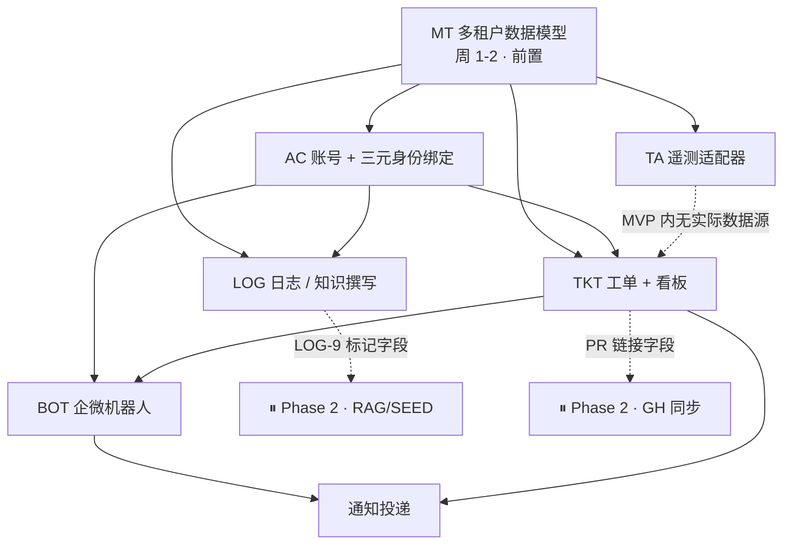

# Relay · MVP（Phase 1）模块设计文档

> **依据**：[relay-prd.md](./relay-prd.md) §4（MVP 详细规格）、§4.11（验收）、§7（待决策）、§8.2（命名规范），
> 以及 [TODO.md](../TODO.md)（Phase 1 任务拆解）。

| | |
|---|---|
| **文档状态** | 草案 · 待评审。存在未决问题（见 §12），部分模块设计**故意留空**并标注 ⛔。原 ⛔2（首批目标团队）已决策为 **AI 网关团队**，TA-2 与 TKT-2 的默认集随之锁定；⛔15（企微 API）已落地：智能机器人 API 模式**本企业已开通**，载体定案，第 1 周 spike 降级为参数确认；D-0 技术栈已定稿（Python + Vue 3 + 自建 PostgreSQL / RLS），仅"过滤强制点下沉"一处待点头 |
| **覆盖范围** | 仅 MVP：MT · TA · AC · LOG · TKT · BOT · INT（68.5 pd） |
| **不覆盖** | ⏸ GH / RAG / SEED / 网关路由（Phase 2 身份，第 7–12 周开工，不进 MVP 验收）。本文只描述**为它们预留的挂载点** |
| **抽象层次** | 逻辑设计。**PRD 未选定语言、框架、数据库、消息队列、对象存储、检索引擎**，本文一律以能力接口（Port）描述，不做隐含选型——见 [D-0](#d-0-技术栈选型未定) |
| **命名** | 严格遵循 §8.2 锁定名：`@Relay` · `relay.internal` · `RL-` · `relay-mcp`（`relay-sync[bot]` / `relay:meta` 属 ⏸ GH，MVP 不出现） |

---

## 1. 设计总览

### 1.1 模块依赖



三条不可违反的时序（PRD §4.10②，TODO 排序规则 1/2/4）：

1. **MT 与 TA 在第 1–2 周独占完成**，不与功能开发并行。任何一张表漏了 `tenant_id`，后续所有模块跟着返工。
2. **TA 在 MVP 内没有可演示产出**，它是技术债预付。设计上必须保证「除适配器外无任何代码直连 Gateway API」这一条可被静态检查。
3. **企微 API 可行性验证（BOT-1 spike）仍排第 1 周，但性质变了**：载体已定（智能机器人已开通 + 自建应用出站，§7.1），[D-5](#d-5-企微能力边界未验证) 关闭，它不再能推翻 BOT-3/BOT-4 的流程。留在第 1 周是因为 **`from.userid` 的口径决定 `identity_binding` 怎么建表**（[D-13](#d-13-企微-userid-的口径与稳定性)），而 MT-1 / AC-6 就在第 1–2 周。

### 1.2 分层与横切约束

```
┌───────────────────────────────────────────────────────────┐
│ 接入层   Web UI · 企微机器人回调 · 企微应用消息出口          │
├───────────────────────────────────────────────────────────┤
│ 应用层   命令 / 查询编排 · 权限校验（AC-4 服务层）          │
├───────────────────────────────────────────────────────────┤
│ 领域层   账号 · 日志 · 工单 · 机器人会话 · 通知             │
├───────────────────────────────────────────────────────────┤
│ 端口层   RepositoryPort（强制租户过滤）· TelemetryAdapter   │
│          SearchPort · BlobPort · IMPort · LLMPort           │
├───────────────────────────────────────────────────────────┤
│ 基础设施 数据库 · 检索 · 对象存储 · 企微 API · LLM 供应商    │
│          ← 全部未选型，仅约定端口契约                        │
└───────────────────────────────────────────────────────────┘
```

**横切约束（对所有模块生效，不可局部豁免）**

| 约束 | 规则 | 强制手段 |
|---|---|---|
| 租户 | 每个请求进入应用层即确立 `TenantContext`，向下必须携带；Repository 无 context 时**直接抛错，不做全表查询** | MT-3 + MT-6 负向测试 |
| 身份 | 所有写操作记录 `actor_id`、`actor_source`（`web` / `wecom` / `system`） | 审计表约束 |
| 时间 | 统一 UTC 存储，展示层按租户时区渲染；聚合窗口、TTL 一律以 UTC 计算 | — |
| 审计 | 账号、权限、分享级别、工单状态、绑定关系的变更全部落 `audit_log` | 领域事件统一落库 |
| 幂等 | 所有外部回调（企微）与重试路径按 `(tenant_id, source, external_id)` 去重 | 唯一索引 |
| 错误 | 面向用户的失败必须给出**下一步**（PRD §4.9⑦ 的原则在 MVP 提前用于机器人与绑定流程） | 文案清单 |

---

## 2. MT · 多租户数据模型

**PRD §4.1 · 8 pd · 🔒 不可砍 · 第 1–2 周**

> **范围（必读，最容易读反的一条）**：做的是**数据模型层多租户**；租户计费、租户自助管理后台、跨租户共享策略、租户级配置隔离、按租户模型路由都是 Phase 2+ 的**产品功能**，MVP 不做。这一对经常被读反，读反的代价是数周重构。

### 2.1 实体清单（MT-1 的产出物）

**全部带 `tenant_id`，无例外。** 下表即「定义性实体清单」，后续新增实体必须先进这张表。

| 域 | 实体 | 关键字段（除 `tenant_id` / 审计字段外） |
|---|---|---|
| 租户 | `tenant` | `id`, `name`, `slug`, `status`, `timezone` |
| 账号 | `user` | `email`, `password_hash`, `status`, `role`, `totp_secret?`, `last_login_at` |
| 账号 | `identity_binding` | `user_id`, `provider`(`wecom`/`github`), `external_id`, `external_id_kind`（建议，见 [D-13](#d-13-企微-userid-的口径与稳定性)）, `external_name`, `bound_at` |
| 账号 | `binding_challenge` | `provider`, `code`, `external_id`, `expires_at`, `consumed_at` |
| 账号 | `invitation` | `email`, `role`, `token`, `expires_at`, `accepted_at` |
| 账号 | `email_domain_allowlist` | `domain`, `default_role` |
| 空间 | `space` / `space_member` | `name`; `user_id`, `space_role` |
| 日志 | `log` | `space_id`, `title`, `body`, `format`, `share_level`, `knowledge_candidate`, `current_version` |
| 日志 | `log_version` | `log_id`, `version_no`, `body`, `author_id`, `created_at` |
| 日志 | `log_share_grant` | `log_id`, `grantee_user_id`（L1 用） |
| 日志 | `log_edit_lock` | `log_id`, `holder_id`, `acquired_at`, `expires_at` |
| 日志 | `log_template` | `key`, `name`, `body` |
| 通用 | `attachment` | `owner_type`, `owner_id`, `blob_key`, `filename`, `size`, `mime` |
| 工单 | `ticket` | `number`, `type`, `title`, `description`, `status`, `priority`, `assignee_id`, `reporter_id`, `iteration_id`, `pr_url`, `ai_context` |
| 工单 | `ticket_comment` / `ticket_label` / `label` / `iteration` | — |
| 工单 | `ticket_status_history` | `from`, `to`, `actor_id`, `reason?` |
| 工单 | `ai_context_field_config` | `field_key`, `label`, `type`, `visible`, `domain_scope` |
| 机器人 | `bot_message_event` | `external_msg_id`, `chat_id`, `from_external_id`, `received_at`（幂等去重用） |
| 机器人 | `ticket_draft` | `chat_id`, `requester_user_id`, `context_snapshot`, `draft_payload`, `context_span`, `state`, `expires_at` |
| 机器人 | `bot_question_log` | `chat_id`, `from_external_id`, `raw_text`, `replied_template`, `created_at`（BOT-8，Phase 2 SEED 的需求样本） |
| 通知 | `notification` / `notification_delivery` | `recipient_id`, `type`, `payload`; `channel`, `state`, `aggregated_into` |
| 平台 | `audit_log` | `actor_id`, `action`, `target_type`, `target_id`, `before`, `after` |
| 平台 | `llm_call_record` | `feature`, `model`, `prompt_tokens`, `completion_tokens`, `cost`, `latency_ms`（INT-10 预算告警的唯一数据源） |
| ⏸ 预留 | `knowledge_unit` | Phase 2 建表，但**向量库的租户过滤在 MVP 就落地**（MT-5） |

> 少数真正的系统级表（`schema_migration`、`tenant` 自身）不适用 `tenant_id`。**这类豁免必须是显式白名单**，写进 MT-2 的 lint 配置并附理由，不允许"这张表看起来不需要"的口头豁免 → 见 [D-1](#d-1-系统级表的-tenant_id-豁免白名单)。

### 2.2 强制过滤（MT-3）

- 租户过滤**强制点放在数据库（PostgreSQL RLS），Repository 层只做便利注入** → [D-0](#d-0-技术栈选型未定)。业务代码看不到也绕不过；**绝不交给业务代码自觉，更不交给提示词**。
  落地形态（技术栈已定稿）：SQLAlchemy 在事务开始时发 `SET LOCAL app.tenant_id = :id`（`begin` 事件挂一次，业务代码零感知），表上 `ENABLE` + **`FORCE ROW LEVEL SECURITY`**，应用以**非 owner 角色**连接——owner 默认绕过 RLS，这一步漏了整套形同虚设。
  （原方案为"注入在 Repository / ORM 层"。改动理由：ORM 层挡不住裸 SQL 逃逸口，而下面第 4 条要求挡住它。**这一处是相对原设计的实质变更，待技术负责人点头后去掉本行。**）
- `TenantContext` 缺失时的行为是**抛异常**，不是"退化为全租户查询"。
- 唯一的跨租户路径是显式声明的 `SystemRepository`，只有迁移与平台运维用得到，且每次调用落审计。
- **原生 SQL / 查询构造器的逃逸口**同样要走过滤。若按 D-0 建议采用 RLS，这一条**自动成立**，裸 SQL 不再是安全缺口，也就不必在 lint 里禁用它；若最终不采用 RLS，则必须在 lint 里禁用裸 SQL 或要求显式标注。

### 2.3 索引与向量库

- 所有租户内查询路径建复合索引，**`tenant_id` 为前导列**（MT-4）。典型：`(tenant_id, status, updated_at)`、`(tenant_id, assignee_id, status)`、`(tenant_id, space_id, updated_at)`、`(tenant_id, number)` 唯一。
- **向量库隔离（MT-5）**：租户过滤写在**查询谓词内部**，不是取回后再筛。MVP 无知识入库，但**空库时就把隔离建好**——往已灌数据的向量库补隔离，正是 MT 存在的意义所在。
  载体已定为 **pgvector，与业务表同库**（[D-0](#d-0-技术栈选型未定) Q1 已确认自建 PG 可装扩展）。这让 MT-5 从"另设计一套隔离机制"缩成"建表时打开 RLS"——**它与业务表共用同一条 policy，没有第二套东西需要验证**。

### 2.4 验收

- 一条**故意越权**的 Repository 层查询取不到别的租户数据（MT-6 负向用例，读与写各一组）。
- **MT-2 建议实现为「迁移后对真实库跑断言」，而不是对模型代码做 lint**：CI 起一个空库 → 跑完 Alembic 全部迁移 → 查 `information_schema` / `pg_class`，断言每张表都有 `tenant_id`、`relrowsecurity` 与 `relforcerowsecurity` 均为真，白名单（[D-1](#d-1-系统级表的-tenant_id-豁免白名单)）之外一律失败。
  **为什么比 lint 强**：手写 SQL 的迁移、`op.execute()` 里的建表、ORM 之外的任何路径，lint 全看不见，而断言看的是最终事实；顺带把"RLS 忘了打开 / 忘了 FORCE"也一起拦住——这是 RLS 方案唯一的人为失误面。任何缺 `tenant_id` 的新表**直接失败**，机械拦截，不靠 code review。
- 上线前一次渗透抽测（§4.11①）。

---

## 3. TA · 遥测适配器接口

**PRD §4.2 · 5 pd · 🔒 不可砍 · 第 1–2 周**

> ⚠️ **评审前请先说清楚**：四个消费方（告警建单、变更归因、ChatOps 只读、环境快照）全在 Phase 2+；RAG 与自有网关同样在 Phase 2，因此 MVP 内唯一消费方是 §4.3 的字段填充，而那些字段在 MVP 是空的。
> **本模块在 MVP 没有可演示产出，它是技术债预付，且仍不可砍。** 两句话都要说出口，否则第 2 周评审时它极易被当成"没做出东西"挤掉。

### 3.1 接口契约（TA-1）

```
interface TelemetryAdapter {
  queryMetrics(dimensions, timeWindow)   -> MetricSeries[]
  getTrace(traceId)                      -> Trace | NotFound
  sampleRequests(filter, n)              -> RequestSample[]   // 默认脱敏
  listRecentChanges(timeWindow)          -> ChangeEvent[]
  getProviderHealth()                    -> ProviderHealth[]
  getCostBreakdown(dimensions, timeWindow) -> CostBucket[]
}
```

数据契约要点（接口的价值全在这里，不在方法名）：

| 类型 | 必备字段 | 约定 |
|---|---|---|
| `MetricSeries` | `metric`, `dimensions{}`, `points[{ts, value}]`, `unit` | 时间粒度由实现声明，不由调用方假设 |
| `Trace` | `trace_id`, `spans[{name, start, duration, status, attrs}]` | 不承诺全链路完整性，缺失用显式 `partial` 标记 |
| `RequestSample` | `trace_id`, `provider`, `model`, `error_class`, `token_usage` | **默认不含 payload**（TA-3） |
| `ChangeEvent` | `kind`(deploy/config/provider), `at`, `ref`, `actor` | 供 Phase 2 变更归因 |
| `ProviderHealth` | `provider`, `state`, `since`, `detail?` | — |
| `CostBucket` | `dimensions{}`, `tokens`, `cost`, `currency` | 与 INT-10 的自记账口径需可对齐 |

- **时间窗口**统一为半开区间 `[from, to)`，UTC。
- **错误语义**统一：`Unavailable`（后端不可用）/ `Unsupported`（该适配器不支持此能力）/ `RateLimited`。`Unsupported` 是必需的——Phase 2 的 OpenTelemetry / Langfuse 适配器天然缺能力。
- **多租户**：`tenant` 作为维度传入，由适配器实现负责下推；不允许调用方取回后过滤。

### 3.2 实现与约束

- **TA-2** 自有 AI Gateway 适配器：✅ 首批目标团队已定为 **AI 网关团队**（PRD §7.1 第 2 条），首个适配器就是**该团队自己的 AI Gateway**——数据源、字段 schema 与 on-call 全在目标团队内部，缺维度可以当面补，这是首批选它的最大好处。默认集据此锁定：
  - **维度**：`tenant` · `provider` · `model` · `route` / `routing_policy` · `gateway_version` · `env` · `error_class`
  - **指标**：请求量 · 错误率 · 时延 p50/p95/p99 · token 用量 · 成本 · provider 健康与 failover 事件
  - **维度名以网关现有字段为准，不另造一套**；对不上的在适配器内映射。⚠️ **网关专属维度只能作为 `dimensions{}` 的键存在，不得升格为 TA-1 的契约字段**——否则 Phase 2 的 LiteLLM / OpenTelemetry / Langfuse 适配器一个都实现不出来，`Unsupported` 也就失去了意义。
- **TA-3** `sampleRequests` 脱敏：样本默认不带请求/响应正文；需要正文的场景在 Phase 2 单独走审批开关。
- **TA-4** 一致性测试套件：Phase 2 的适配器（LiteLLM / Portkey / OpenTelemetry / Langfuse / 云网关）拿到的是**一份可执行契约**，而不是一份要读的代码。
- **架构守卫**：CI 加一条静态检查——`adapters/telemetry/*` 之外的任何代码不得引用 Gateway 的 SDK / HTTP 客户端。这是"没有应用代码直连 Gateway"这条验收标准的机械保证。

---

## 4. AC · 账号与三元身份绑定

**PRD §4.4 / §4.5 · 10 pd**

MVP **不含 SSO**（已决策）。直接后果：身份映射从"通讯录自动同步"变成"用户自助绑定"，而**企微 userid 绑定是机器人可用性的硬前置**——建单、通知触达、消息归属全依赖它。

### 4.1 注册与认证（AC-1 / AC-2 / AC-3）

- **邀请制**为主：Admin 发邀请 → 一次性 token（默认 7 天过期）→ 设置密码。
- **企业邮箱域名白名单**为辅：命中白名单可自助注册，注册后角色取白名单配置的默认角色。
- 密码策略：长度 + 复杂度 + **90 天到期提醒**（提醒，非强制改密 → [D-2](#d-2-密码-90-天到期是提醒还是强制)）。
- 登录失败锁定（阈值 + 冷却）、会话超时、异地登录提醒（依据 IP 段/UA 变化，邮件通知）。
- **TOTP 可选**，建议对 Admin 强制开启（配置项，默认开）。

### 4.2 角色与权限（AC-4 / AC-5）

三个角色，**权限判定在服务层**，不做细粒度 RBAC。

| 能力 | Admin | Member | Guest |
|---|:--:|:--:|:--:|
| 用户管理 / 邀请 / 角色变更 | ✅ | ✕ | ✕ |
| 机器人与集成配置 | ✅ | ✕ | ✕ |
| AI 上下文字段显隐配置（TKT-2） | ✅ | ✕ | ✕ |
| 日志创建 / 编辑自己的 | ✅ | ✅ | ✕ |
| 工单创建 / 编辑 / 流转 | ✅ | ✅ | ✕ |
| 评论 | ✅ | ✅ | ✕ |
| 查看内容 | 按分享级别 | 按分享级别 | **仅显式授权（L1）与 L3** → [D-3](#d-3-guest-与-l2l3-分享的可见性边界) |

**空间**只有一层（`space`），不做嵌套。空间成员关系决定 L2 分享的可见范围。

### 4.3 三元身份绑定（AC-6 🔒 / AC-7）

**企微 userid 绑定流程（AC-6 + BOT-6）**

```
用户私聊 @Relay 发送「绑定」
   ↓ 机器人生成 6 位验证码（TTL 10 分钟，一次性，按 external_id 频控）
   ↓ 私聊回码 + 平台设置页链接
用户在平台「设置 → 身份绑定」输入验证码
   ↓ 校验：未过期 / 未使用 / 同租户
   ↓ 建立 identity_binding(user_id, provider=wecom, external_id)
完成：机器人私聊回执 + 平台提示
```

约束：

- **唯一性双向**：一个平台账号最多绑一个企微 userid，一个企微 userid 最多绑一个平台账号（`(tenant_id, provider, external_id)` 与 `(tenant_id, provider, user_id)` 双唯一索引）。
- **租户归属**：私聊场景下平台先知道的是企微 `corp_id` / `agent_id`，不是租户。因此需要一张 **企微应用 → 租户 的映射**，作为绑定与群消息路由的入口 → [D-4](#d-4-企微-corp--租户的映射关系)。
- **换绑 / 解绑 / 离职回收**：PRD 未定义 → [D-6](#d-6-解绑换绑与离职账号的绑定回收)。
- **验证码不可枚举**：错误次数上限 + 失败计入锁定。

**GitHub handle 绑定（AC-7）**：GitHub OAuth，无需手输。⚠️ 它是**砍单清单第 5 位**——三项用途（@提及翻译、PR 关联、责任人映射）全服务于 Phase 2 的 GH，MVP 可退化为手工粘 PR 链接。**但必须在 Phase 2 GH-1 开工前补齐。**

### 4.4 未绑定用户降级矩阵（AC-8，逐条实现，逐条测试）

| 场景 | MVP 行为 |
|---|---|
| 群内 `@Relay` 提问 | 原则上允许（问答不需要身份）——但 **MVP 无问答能力**，统一回 BOT-8 引导话术；放行路径在 Phase 2 生效 |
| 群内 `@Relay 建单` | **拒绝**，私聊引导绑定，流程终止（工单必须有真实 reporter）。私聊引导是平台主动发起，只能走自建应用 `message/send` → §7.1 双通道 |
| 通知触达 | 降级为站内信 + 邮件 |
| ⏸ GitHub 同步遇未映射用户 | 随 GH 推后。原则不变：**绝不误 @ 到无关账号** |

**验收**：AC-8 每一条**活跃路径**都有测试覆盖。

> **运维风险，现在就要记进手册**：没有 SSO，**离职/转岗不会自动停用账号**。上线前必须存在管理员手动流程（建议挂进 HR 离职 checklist），否则会成为安全审计问题项。责任人未定 → PRD §7.2 第 6 条。

---

## 5. LOG · 日志与知识撰写

**PRD §4.6 · 15 pd**

### 5.1 编辑与渲染（LOG-1 / LOG-2 / LOG-3）

- **双模式**：Markdown / 纯文本，实时分屏预览。
- 渲染：GFM 全集 + 代码高亮 + **Mermaid** + 工单卡片内联 `#331`（解析为当前租户内的工单引用，渲染为状态卡片；无权限或不存在时降级为纯文本，不泄露标题）。
- **协同**：MVP **不做实时协同编辑**（CRDT 成本高），改为 `log_edit_lock` **编辑锁 + 冲突提示**。锁有 TTL 与心跳续期，超时可被接管 → TTL 与强制接管策略见 [D-7](#d-7-日志编辑锁的-ttl-与强制接管)。

### 5.2 版本与回滚（LOG-4）

- 自动保存产生**版本快照**，版本历史保留 **90 天**。
- diff 视图按行；**回滚 = 以旧版本内容创建新版本**，历史不删、不改写。
- 90 天之后的历史如何处理（清理 / 归档 / 仅保留里程碑版本）未定 → [D-8](#d-8-90-天之后的版本历史如何处理)。

### 5.3 分享（LOG-6）

| 级别 | 语义 | 判定 |
|---|---|---|
| L0 | 私密 | 仅作者 + Admin |
| L1 | 指定人 | `log_share_grant` 命中 |
| L2 | 空间内 | 该日志所属 space 的成员 |
| L3 | 全组织 | **本租户内**全体（跨租户永远不可见——这条由 MT 保证，不由 LOG 判断） |

**判定顺序**：租户过滤（MT，前置且不可绕过）→ 分享级别 → 角色。
**L4 外链分享与 DLP 扫描不做**——外链是最大泄露面，MVP 不开这个口子。

### 5.4 附件与搜索（LOG-5 / LOG-8）

- 附件走 `BlobPort`：上传大小/类型限制、病毒扫描位（MVP 可空实现）、**访问必须经权限校验后再签发短时链接**，不能靠"URL 猜不到"。存储路径需按租户分区 → [D-9](#d-9-附件存储的租户隔离方式)。
- 全文搜索走 `SearchPort`：MVP 至少覆盖日志标题 + 正文 + 工单标题；**中文分词**是实现关键。载体定为 **PostgreSQL 全文检索 + 中文分词扩展**（首选 pgroonga，装不上退 zhparser，[D-0](#d-0-技术栈选型未定) Q1 已确认可装）——不引入独立检索服务。`SearchPort` 仍然保留：它现在的作用是让 pgroonga ↔ zhparser 的切换、以及 Phase 2 若真需要外部引擎时的替换，不波及业务代码。

### 5.5 「加入知识库」标记（LOG-9 🔒）

**只做字段 + 勾选交互**：`knowledge_candidate`（bool）、`marked_by`、`marked_at`。
⏸ 向量化与索引随 RAG 推后。

> **为什么半做**：第 6–12 周写的每篇日志都已带上"该不该进知识库"的人工判断，Phase 2 开索引时可以**直接回溯全部历史**。字段一起砍掉的话，Phase 2 冷启动要额外背一轮全量重标注。约 0.5 pd 换掉一个 Phase 2 启动阻塞——所以它是 🔒。

**埋点**：`knowledge_candidate = true` 的"有意义正样本"计数是验收项（≥ 30 篇），需要在 INT-8 看板里定义"有意义"的判定（正文长度下限？人工抽检？）→ [D-10](#d-10-有意义的知识库正样本如何判定)。

### 5.6 不做

L4 外链 + DLP · 实时协同编辑 · `!trace:` / `!metric:` 内联语法（依赖网关集成）· AI 辅助撰写与日报自动生成。

---

## 6. TKT · 工单与看板

**PRD §4.7 / §4.3 · 13 pd**

### 6.1 实体与字段（TKT-1）

类型（Bug / Feature / Task）· 标题 · 描述 · 状态 · 优先级 P0–P3 · 负责人 · 报告人 · 标签 · 迭代 · **关联 PR（MVP 为手工粘贴的纯链接字段，无状态回传、无 CI/Review 状态）** · 评论。

### 6.2 状态机（TKT-3）

```
Todo ──▶ In Progress ──▶ In Review ──▶ Done
  │           │              │
  └──────▶ Blocked ◀─────────┘        （Blocked 可从任一进行中状态进入，恢复回原状态）
  └──────▶ Won't Fix                   （终态，可重开回 Todo）
```

- 完整状态机（Triage / Verifying / Reopened）推迟。
- 每次流转写 `ticket_status_history`，`Blocked` / `Won't Fix` **要求填理由**。
- ⚠️ **这套 6 状态对 GitHub 的 open/closed 是有损的**。`In Review`、`Blocked`、`Won't Fix` 将来必须落到 label 或 `state_reason`，是冲突与回环的高发区。**映射矩阵与冲突胜出方必须在 GH-2 开工前显式定义**（⛔ PRD §7.2 第 17 条）——MVP 不做，但状态命名与语义**现在就不要再动**，否则 Phase 2 的映射要重来。

### 6.3 可配置 AI 上下文 schema（TKT-2）

字段以 **`ai_context` 结构化列 + `ai_context_field_config` 配置表**承载：

| 字段 | 通用性 | MVP 状态 |
|---|---|---|
| `trace_id[]` · `provider[]` · `model[]` · `prompt_version` · `deployment` · `error_class` · `eval_run` · `token_cost` · `blast_radius` · `tenant[]` | 通用 AI-Ops | **全租户默认启用**；数据模型预留 + UI 可配显隐，MVP 无自动数据源（可手工填写） |
| `gateway_version` · `routing_policy` | Gateway 专属 | **首批租户（AI 网关团队）默认启用**（`domain_scope` 控制）；其他团队不加载 |

- **做它的唯一理由是避免后期加字段的 migration 与索引重建**，不是 MVP 可用性。评审时按这个理由讲。
- UI 显隐层是**砍单清单第 6 位**（砍掉无影响——字段与 `domain_scope` 配置仍在，只是不给管理员可视化开关）。
- ✅ **默认字段集已锁定**：首批目标团队 = **AI 网关团队**（PRD §7.1 第 2 条）。通用 AI-Ops 字段全租户默认启用；`gateway_version` / `routing_policy` 只在首批租户默认开启，靠 `ai_context_field_config.domain_scope` 控制，**不并入通用集**。
- ⚠️ **首批团队就是网关建设方，带来一个反向的抽象风险**：他们提的每个需求都长得像通用需求，Gateway 专属字段极易被"有真实用户背书"地混进默认通用集——这比为想象用户做抽象更隐蔽。判定标准写死一条：**没有自有网关的团队能否给这个字段填出值？填不出就归 `domain_scope`。**
- MVP 仍**无自动数据源**（告警接入在 Phase 2），但对网关团队而言字段已可**手工填写**（例如粘 `trace_id`），UI 显隐层的实际价值因此上升——不过它**仍是砍单清单第 6 位**，不因此提级。

### 6.4 视图（TKT-5 / TKT-6 / TKT-7 / TKT-9）

- 列表 + 过滤（状态、负责人、优先级、标签、迭代、关键词）。
- 看板按状态分组、支持拖拽（**砍单清单第 3 位**）。
- 「我的工单」。
- 详情页 + **`RL-` 编号** + 稳定永久链接 `https://relay.internal/t/331`。
  ⚠️ **多租户下编号唯一性有冲突**：`/t/331` 未带租户维度。编号按租户内递增则链接可能撞号，全局递增则编号会跳。这条必须在 TKT-1 之前定 → [D-11](#d-11-rl--编号与永久链接在多租户下的唯一性)。
- 甘特与日历不做；域特有字段的自动填充不做（无数据源）。

### 6.5 评论与通知（TKT-4）

评论 + `@提及`。@提及、指派、状态变更三类事件产出 `notification`，交给统一通知服务（§7.5）。

---

## 7. BOT · 企微机器人

**PRD §4.8 · 10 pd · 第 7–8 周 · MVP 的最后一块**

**触发方式只做 `@Relay`，不做全群监听。** 理由：误报代价高（插话一次，一周内被静音，静音不可逆）、隐私接受度、每条消息过模型的成本、以及 MVP 阶段根本没有"什么算问题"的评测基线。
被动监听 + **私聊**提醒建单是 OPT-1（折中方案，砍单清单第 1 位，⛔ PRD §7.1 第 3 条）——**不在 MVP 基线内**。

### 7.1 接入与路由（BOT-1）

**载体已定（见 §12「已澄清」）**：群机器人 Webhook 只能出站推送、**收不到 `@`**，直接排除。**智能机器人 API 模式本企业已开通**——原本最大的设计分叉（A 还是 B）不存在了，MVP 按下面这套**双通道**实现，不留备选：

| 通道 | 承担 | 关键约束 |
|---|---|---|
| **入站与会话内回复**<br/>智能机器人（API 模式）· ✅ 已开通 | 回调接收 `@` 与私聊、草稿卡片、卡片原地更新、状态卡片、绑定回码 | `response_url` 自用户发消息起 **6 分钟**窗口、支持流式；回调带 `quote`（仅用户确实引用时存在，覆盖 text/image/mixed/voice/file/video）；卡片点击推 `template_card_event`，`aibot_respond_update_msg` 原地更新，但**收到事件后 5 秒内必须响应** |
| **出站主动消息**<br/>自建应用 `message/send` | BOT-7 通知、AC-8 私聊引导、投递失败重试 | `gettoken` + `getcallbackip` 白名单；只能发个人/部门/标签，**发不进群线程**；被动回复 5 秒限制与它无关（我们不用它收消息） |

- **为什么出站不能也用智能机器人**：`response_url` 只对当前会话有效，而 AC-8 的「群内建单被拒 → 私聊引导绑定」与 BOT-7 的指派 / @提及通知都是**平台主动发起**，手上没有 `response_url`。所以自建应用不是备选方案，是**必建的第二条通道**——它的申请与可见范围要和智能机器人一起在第 1 周办完，别等到第 7 周。
  ⚠️ **两条通道的 userid 必须是同一口径**，否则绑定建立在智能机器人侧、通知发在自建应用侧，会对不上人 → [D-13](#d-13-企微-userid-的口径与稳定性)。**这是 ⛔15 剩下的最后一颗钉子。**
- **幂等**：智能机器人回调的 `msgid` 即 `bot_message_event.external_msg_id`，官方明确要求据此排重；自建应用侧超时会重试 3 次。**幂等不是可选项。**
- 回调验签与 AES-256-CBC + PKCS#7 解密；回调 URL 验证需在 1 秒内原样返回解密后的 `echostr`。
- **入口路由表**：

| 输入 | 分支 | MVP |
|---|---|---|
| `@Relay 建单 <描述>` | 建单流程 | ✅ BOT-3 |
| 引用消息 + `@Relay 建单` | 建单流程（带引用上下文） | ✅ BOT-4 |
| `@Relay #331` | 工单状态卡片 | ✅ BOT-5（砍单第 4 位） |
| `@Relay 绑定` / 私聊「绑定」 | 身份绑定 | ✅ BOT-6 |
| 其余 `@Relay ...` | **固定引导话术 + 记录问题**，绝不沉默 | ✅ BOT-8 |
| `@Relay <问题>` → RAG 答案卡 | — | ⏸ Phase 2（BOT-2 / BOT-9） |

> **第 1 周 spike（0.5 pd，排序规则 4）—— 已从「能力验证」变成「参数确认」。** 原来的第 1 项（本企业能否开智能机器人）已确认**可用**，`quote` 与卡片按钮也有官方文档背书，**BOT-3 的群内确认卡片成立，设计分叉消除**。剩下四项，没有一项会推翻流程，但第 1 项会推翻**表结构**：
> 1. 🔺 **`from.userid` 是明文还是企业主体下的加密 userid**（官方：机器人创建者为超管时明文，否则加密），换创建者 / 换应用后是否变化 → [D-13](#d-13-企微-userid-的口径与稳定性)。**AC-6 与 MT-1 都在第 1–2 周，这一项必须在建表前有答案。**
> 2. 智能机器人与自建应用两条通道拿到的 userid 是否同一口径（同上）；
> 3. **出站用的自建应用是否已就绪**（agentid / secret / 可见范围 / 回调 IP 白名单）——入站已开通不等于出站也开通了；
> 4. 应用消息的频率限制（BOT-7 聚合窗口的参数依据）。
>
> spike 本身仍排第 1 周：现在它便宜，且第 1 项直接决定 `identity_binding` 怎么建表。

### 7.2 建单流程（BOT-3 🔒 —— MVP 唯一的 AI 价值证明点）

```
① 身份校验    未绑定 → 私聊引导绑定，流程终止（不建单）
② 上下文抓取  被引用消息 + 群内前后若干条（默认前 5 条）
③ AI 生成草稿 标题 / 描述 / 类型 / 优先级建议
④ 群内确认卡片【创建】【编辑】【取消】· 5 分钟未响应自动失效
⑤ 创建工单 → 卡片原地更新为工单链接（⏸ Phase 2 起在此步同步 GitHub）
```

**永远不自动创建，确认是强制的。** 工单是有 owner 和 SLA 的实体，误建的成本远高于少建。

**草稿卡片状态机**：`Pending → Created | Edited→Created | Cancelled | Expired`。
`ticket_draft` 存 `context_snapshot`（抓到的原始消息）与 `draft_payload`（AI 产出），两者都要留——确认率的度量要靠它们对比。

**两条来自企微侧的硬时序（智能机器人，已核实且本企业已开通）**：

| 环节 | 窗口 | 设计后果 |
|---|---|---|
| ③ AI 生成草稿 → ④ 发出卡片 | 自用户发消息起 **6 分钟**（`response_url`，可流式） | LLM 生成**不受 5 秒限制**，§7.2 的降级路径是为模型故障准备的，不是为超时准备的 |
| ④ 用户点【创建】→ ⑤ 卡片更新 | 收到 `template_card_event` 后 **5 秒内**必须响应 | **建单不能在这 5 秒里同步做完**。先把卡片原地更新为「创建中」，落库拿到 `RL-` 编号后再更新一次为工单链接——两次 `aibot_respond_update_msg`，不是一次 |

**上下文抓取按「有 `quote` 用 `quote`，无 `quote` 回退前 N 条」实现**：`quote` 只在用户确实引用了消息时才出现在回调里，所以 BOT-3（无引用）与 BOT-4（有引用）走的是同一条抓取管线的两个分支，不是两套实现。

**上下文范围可见可调**：卡片上明示「已包含前 5 条」，可展开到 10 条。
> PRD 的实施提示说得很直接：**草稿质量主要取决于第 ② 步的抓取范围，不是 prompt。把范围做成可见可调，比调 prompt 见效快。**

**LLM 调用契约（`LLMPort`）**

- 输入：抓取的消息序列（含发送人显示名、时间）、租户的工单类型与优先级定义。
- 输出：`{title, description, type, priority, confidence}`，**结构化输出，解析失败即视为降级**。
- **降级路径（必须有）**：LLM 超时 / 失败 / 预算熔断 → 仍然出确认卡片，标题取原消息首行、描述取原文，标注「AI 草稿不可用，已用原文填充」。**不能因为模型挂了就让建单不可用**。
- MVP 的 LLM 调用**直连供应商**（网关路由在 Phase 2），因此每次调用必须自记账写 `llm_call_record`——这是 INT-10 预算告警唯一的数据来源。

**⚠️ 确认率 > 60% 是硬门槛，口径必须先定。** 「未大幅编辑即创建」需要一个可计算的定义（标题相似度阈值？被修改字段数？描述编辑距离占比？）。**没有口径，这一格验收时填不出来** → [D-12](#d-12-草稿确认率--60-的判定口径)。

### 7.3 状态查询与绑定（BOT-5 / BOT-6）

- `@Relay #331` → 状态卡片（状态、负责人、最近更新）。**发起人无权限时不回具体内容**，回"无权访问或不存在"，避免通过机器人探测工单标题。
- `@Relay 绑定` → 私聊触发 §4.3 的绑定流程。

### 7.4 未开放指令的兜底（BOT-8）

固定话术，**绝不沉默**：

> 「问答能力还没开放（预计 Phase 2）。现在可以用 `@Relay 建单 <描述>` 建工单，或 `@Relay #编号` 查状态。」

**并且记录每一条这样的提问**（`bot_question_log`）。这些是 Phase 2 知识种子的真实需求样本——是"该先导入什么"的最好依据，也部分替代了团队没人力做的 shadow 模式。近乎零成本，显著降低 Phase 2 冷启动风险。验收要求 ≥ 50 条。

### 7.5 通知（BOT-7）

- 事件：工单指派、`@提及`、状态变更 → 企微应用消息（自建应用 `message/send`，非智能机器人的 `response_url`——通知没有"当前会话"可回，见 §7.1）。
- **聚合窗口 5 分钟防轰炸**：同一收件人同一类事件在窗口内合并为一条，`notification_delivery.aggregated_into` 记录合并关系。
- 未绑定用户降级为**站内信 + 邮件**（AC-8）。
- 分级路由、免打扰时段、订阅规则 → Phase 2。
- 投递失败重试有上限，失败状态在站内可见（不静默丢）。

---

## 8. INT · 集成、测试与上线

**7.5 pd（MVP 部分）· 跨两个里程碑**

| ID | 内容 | 设计要点 |
|---|---|---|
| **INT-1** | CI 流水线 | 把 MT-6 跨租户负测与 MT-2 schema lint 挂成**阻断式**门禁；再加 TA 的架构守卫检查 |
| **INT-5** | 端到端套件 | MVP 关键链路：**群聊 → 草稿 → 确认 → 工单 → 通知**。⏸ GitHub 回环与知识链路随 GH/RAG 推后 |
| **INT-6** | 里程碑 A 试点 | 双轨（Relay + Jira）运行手册 |
| **INT-7** | Jira 停用 | 数据迁移、冻结日、回退路径。**新增前置**：自建 PG 的备份与**一次真实恢复演练**必须在冻结日之前完成——停用 Jira 等于让 Relay 成为唯一数据源（§11） |
| **INT-8** | 验收指标看板 | **分母必须先钉死**：周活跃创作者占比与群内建单占比都能被少数人刷高。分母（在册人数 vs 已绑定人数）与窗口（自然周）写进看板，不在验收前临时对齐 |
| **INT-9** | 绑定率推动 > 90% | 里程碑 A 门槛，机器人可用性的天花板。**第 5–6 周与双轨试用同步推，不能等机器人上线再推**。含追踪看板、提醒流程、管理员补录路径 |
| **INT-10** | AI 预算硬告警 | 无网关 ⇒ 无按功能拆解的成本视图。所有 LLM 出口统一经 `LLMPort` 记账 → 月度硬上限 + 阈值告警 + **超限熔断**（熔断后 BOT-3 走 §7.2 的降级路径，不是关掉建单）。⛔ 上限值取决于 PRD §7.1 第 5 条 |

### 8.1 MVP 验收对照（§4.11①）

| 类别 | 指标 | 目标 | 判定点 | 本文对应 |
|---|---|---|---|---|
| 安全 🔒 | 跨租户越权读写 | **0** | A | §2.4 |
| 底座 🔒 | 企微 userid 绑定率 | **> 90%** | A 末 | §4.3 · INT-9 |
| 采纳 🔒 | Jira 停用 | **100%**（连续 2 周） | B | INT-7 |
| 采纳 | 周活跃创作者占比 | > 70% | B | INT-8（口径） |
| 机器人 | 群内建单占比 | > 20% | B | §7.2 |
| 机器人 🔒 | 草稿确认率 | **> 60%** | B | §7.2 · [D-12](#d-12-草稿确认率--60-的判定口径) |
| 底座 | 「加入知识库」正样本 | ≥ 30 篇 | B | §5.5 · [D-10](#d-10-有意义的知识库正样本如何判定) |
| 底座 | BOT-8 记录的提问数 | ≥ 50 条 | B | §7.4 |

---

## 9. 跨模块关键链路（端到端）

```
企微群：引用消息 + @Relay 建单
  → 回调验签 → external_msg_id 幂等去重
  → 解析 @ 与指令 → 命中「建单」
  → identity_binding 查询（未绑定 → 私聊引导 → 结束）
  → TenantContext 由「企微应用 → 租户」映射确立   ← D-4
  → 抓取被引用消息 + 前 5 条 → context_snapshot
  → LLMPort 生成草稿（失败 → 原文降级）→ llm_call_record 记账
  → 发送确认卡片（TTL 5 分钟，展示抓取范围，可展开至 10 条）
  → 用户【创建】→ Repository 落 ticket（tenant_id 由 context 注入）
  → 分配 RL- 编号 → 卡片原地更新为 https://relay.internal/t/<n>
  → notification（指派/@提及）→ 5 分钟聚合窗口 → 企微应用消息
  → 埋点：草稿字段 vs 最终字段的差异 → 确认率分子/分母
```

这条链路就是 INT-5 端到端套件要覆盖的全部；它同时穿过 MT / AC / TKT / BOT / INT 五个模块，是 MVP 的主干。

---

## 10. 为 Phase 2 预留的挂载点（MVP 只留接口，不实现）

| 挂载点 | 位置 | 供给 |
|---|---|---|
| `knowledge_candidate` 标记 | LOG-9 | RAG-1 回溯全部历史日志，免二次标注 |
| `bot_question_log` | BOT-8 | SEED 的导入优先级依据 + 上线前自测集 |
| 向量库租户过滤 | MT-5 | RAG-3 直接可用，无需给已灌数据的库补隔离 |
| `TelemetryAdapter` | TA-1 | 告警建单 / 变更归因 / ChatOps 只读 / 环境快照四处免返工 |
| `ai_context` 字段与显隐配置 | TKT-2 | Phase 2 告警接入后才有数据源，届时无需 migration |
| 建单流程第 ⑤ 步 | BOT-3 | GH 同步在此处插入，接口位现在留出 |
| `pr_url` 纯链接字段 | TKT-8 | GH-2 接管后升级为带状态的关联 |

**MVP 不做的**（PRD §4.0 明列，避免范围蔓延）：告警接入与 Auto-Ticket · ChatOps · 外部客户群 · 情绪感知 · 变更归因与环境快照 · SLA 时钟 · On-call 排班 · 变更管理闭环 · AI-DLP · 细粒度 RBAC · L4 外链 · 实时协同编辑 · Trace 下钻 · 完整状态机 · AI 辅助撰写 · MCP Server · AI 评测体系 · 多租户**产品**功能（计费、自助管理、跨租户共享）。

---

## 11. 非功能性设计要点

| 方面 | MVP 立场 |
|---|---|
| 性能 | 无明确 SLO。列表/看板按租户内数据量设计索引（§2.3）；企微回调需在企微超时窗口内返回，**重活一律异步化** |
| 可用性 | 单区部署即可；LLM 与企微为外部依赖，**两者故障都不得导致平台不可用**（见 §7.2 降级） |
| 技术栈 | 后端 **Python 3.12+ / FastAPI / SQLAlchemy 2.x + Alembic / Pydantic v2**；前端 **Vue 3 + TypeScript**；前后端契约走 FastAPI 的 OpenAPI → TS codegen（[D-0](#d-0-技术栈选型未定)） |
| 数据库 | **自建 PostgreSQL**（[D-0](#d-0-技术栈选型未定)）：租户隔离靠 RLS、检索靠 PG FTS + 中文分词扩展、向量靠 pgvector、队列靠 `SKIP LOCKED`——一个组件承载四件事，少一个组件就少一处租户泄漏面 |
| 备份 🔒 | 自建即自负：自动备份 + PITR，**并在 INT-7 冻结日前做一次真实恢复演练**。Jira 停用后工单与日志的唯一副本就在这台库上，没有兜底 |
| 安全 | 租户隔离（MT）· 附件签发短时链接 · 机器人不泄露无权内容 · `sampleRequests` 默认脱敏 · 无 SSO 的账号停用手动流程 |
| 可观测 | 审计日志 · `llm_call_record` · 验收指标看板（INT-8）· 通知投递状态 |
| 国际化 | 平台 UI 与机器人话术**中文**；PRD 为中文，README/TODO 为英文，沿用现有语言分工 |
| 数据保留 | 日志版本 90 天（[D-8](#d-8-90-天之后的版本历史如何处理)）；其余保留策略未定 |
| 运维负担 | 自建 PG 的版本升级、连接池（PgBouncer transaction 模式与 `SET LOCAL` 兼容）、监控告警需有人认领——这是 D-0 选自建换来架构简洁的**对价**，不是免费的 |

---

## 12. 待澄清问题

分三类。**⛔ 类是 PRD 已登记的阻塞项，本文档不越过它们做设计**；D 类是本次设计过程中新发现、PRD 未覆盖的问题。已决策项列在最前，供评审时快速过。

### ✅ 已决策（本轮澄清 · 原 ⛔2）

**首批目标团队 = AI 网关团队（1 个团队）。** 这是原本最紧急的一条（"第 1 周之前"），现已解锁两处设计：

| 解锁项 | 结论 | 详见 |
|---|---|---|
| TA-2 首个适配器 | 该团队自有的 AI Gateway；默认维度与指标集已锁定 | §3.2 |
| TKT-2 默认字段集 | 通用 AI-Ops 字段全租户启用 + `gateway_version` / `routing_policy` 仅首批租户按 `domain_scope` 启用 | §6.3 |

连带影响（都是**降低风险**的方向，不新增工作量）：

- **MVP 实际只有一个租户在跑**：[D-4](#d-4-企微-corp--租户的映射关系) 的「corp ↔ 租户一对一」限制没有代价；[D-11](#d-11-rl--编号与永久链接在多租户下的唯一性) 的「租户内递增 + 链接留出租户段、单租户时隐藏」是当前最省事且不锁死未来的做法。
- **验收分母有了具体人群**：INT-8 / INT-9 的名单可以在第 1 周就钉死（AI 网关团队在册成员），不必等到验收前对齐——口径本身仍待定，见本节末表。
- **TA-2 的实施风险显著下降**：适配器对接的是本团队系统，字段缺失可直接在网关侧补；这也让「除适配器外无代码直连 Gateway」的架构守卫更容易被绕过（同一批人两边都能改），**CI 静态检查因此更不能省**（§3.2）。

**唯一遗留风险（必须写进评审纪要）**：首批团队同时是网关的建设方，"通用字段 vs 网关专属字段"这条边界**缺少对照组**。第二个团队接入之前，不要把任何 Gateway 专属字段升级为通用字段——判定标准见 §6.3。

### ✅ 已澄清（原 ⛔15 · 企微 API）

**两问都有答案了**：官方文档回答了「能不能做」，本企业回答了「能不能开」——**智能机器人 API 模式已开通**。⛔15 因此**移出阻塞表**：BOT-1 / BOT-3 / BOT-4 的设计不再等任何结论，剩下的是第 1 周 spike 的参数确认（§7.1），其中只有 userid 口径一项会影响表结构（[D-13](#d-13-企微-userid-的口径与稳定性)）。

**MVP 形态定案**：入站与会话内回复走智能机器人，出站主动消息走自建应用 `message/send`，两条通道都要在第 1 周办完手续。

已核实的事实（官方文档，非实测）：

| 事实 | 出处 | 打在哪 |
|---|---|---|
| 群机器人 Webhook 只能出站，**收不到 `@`** | 调研结论（webhook 是单向推送接口，无入站回调） | 载体选型：只剩智能机器人 / 自建应用两条路 |
| 智能机器人回调带 **`quote`**（用户引用时才有，覆盖 text/image/mixed/voice/file/video） | [接收消息 100719](https://developer.work.weixin.qq.com/document/path/100719) | **[D-5](#d-5-企微能力边界未验证) 的原风险解除**，BOT-4 成立 |
| 回调带 `msgid`，官方要求据此**事件排重**；`chatid`（仅群聊）/ `chattype`(single·group) / `response_url` | 同上 | §7.1 幂等字段落地；`external_msg_id` = `msgid` |
| `from.userid`：创建者为超管时明文，**否则为企业主体下的加密 userid** | 同上 | **新发现的坑** → [D-13](#d-13-企微-userid-的口径与稳定性) |
| 流式回复自用户发消息起 **6 分钟**窗口 | 同上 | BOT-3 的 LLM 生成不受 5 秒限制 |
| 模板卡片点击推 `template_card_event`，`aibot_respond_update_msg` 可原地更新，**收到事件后 5 秒内须响应** | [长连接 101463](https://developer.work.weixin.qq.com/document/path/101463) · [更新模板卡片 94888](https://developer.work.weixin.qq.com/document/path/94888) | BOT-3 第 ⑤ 步必须拆成「创建中」→「工单链接」两次更新 |
| 自建应用：被动回复 **5 秒**、超时重试 3 次；`message/send` 只能发个人/部门/标签 | [回调配置 90930](https://developer.work.weixin.qq.com/document/path/90930) · [发送应用消息 90236](https://developer.work.weixin.qq.com/document/path/90236) | 路线 B **回不到原群线程**；出站主动消息只能走这条 |

> **核对程度不一致，评审时按此区分**：`quote` / `msgid` / `chatid` / `chattype` / `from.userid` / `response_url` / 6 分钟窗口已直接核对 [100719](https://developer.work.weixin.qq.com/document/path/100719)；模板卡片事件核对 [101463](https://developer.work.weixin.qq.com/document/path/101463) / [94888](https://developer.work.weixin.qq.com/document/path/94888)；**群机器人 Webhook 与自建应用两行来自调研整理，未逐条回原文核对，spike 时顺带复核。**
>
> 调研来源：[WorkBuddy · 创建企业微信机器人以回答和建 issue](https://www.workbuddy.cc/agents/tasks/share/Txjx7V5woB?platform=workbuddy-ai)（其中"创建 ISSUE"一节列的是 GitHub / Jira / TAPD 等外部系统，对 Relay 不适用——我们建的是自己的工单）。

### ⛔ 阻塞类（引用 PRD §7.1 / TODO Blocked on decision）

> ⛔ 类**已无第 1 周阻塞项**（2 与 15 都已落地）。第 1 周唯一还卡着开工的是 D 类的 [D-0 技术栈选型](#d-0-技术栈选型未定)——MT-3 的过滤注入方式直接取决于它。

| # | 问题 | 阻塞 | 需要时点 |
|---|---|---|---|
| **16** | **绑定率 > 90% 由谁推、什么时候推？** | INT-9 | 第 5 周之前 |
| **5** | **AI 月度成本上限？** 决定默认模型档位与缓存激进程度；无网关时是唯一兜底 | INT-10 · BOT-3 模型档位 | 第 7 周之前 |
| **3** | 是否纳入群内被动监听（私聊提醒建单）？ | OPT-1 | 第 9 周之前 |
| **6** | 无 SSO 期间的离职账号停用由谁执行？ | AC-8 运维手册 | 上线前 |
| **17** | GitHub 状态映射矩阵（6 状态 → open/closed + label/state_reason，冲突谁胜） | ⏸ GH-2 / GH-11 | GH-1 之前 |
| **18** | 入站脱敏的最小范围与误报白名单流程 | ⏸ RAG-10 | SEED-1 之前 |

### D 类 · 本次设计新发现（PRD 未覆盖，需产品/技术负责人确认）

#### D-0 技术栈选型 · ✅ 已决策
PRD 刻意不选语言、框架、数据库、检索引擎、对象存储、队列，本文档一度只能停在端口契约层。**两个前置事实已确认（见本条末），选型据此定稿**，端口契约全部保留——它们现在的作用不再是"回避选型"，而是隔离将来可能替换的部分。

##### 定稿（Q1 / Q2 已答）

| 轴 | 结论 |
|---|---|
| 数据库 | **自建 PostgreSQL**（扩展可装） |
| 租户强制 | **RLS + Repository 便利层**（⚠️ 见下方"唯一待点头项"） |
| 全文检索 | **PG FTS + 中文分词扩展**（首选 pgroonga，装不上退 zhparser） |
| 向量 | **pgvector，与业务表同库** |
| 队列 | **PG 表 + `FOR UPDATE SKIP LOCKED`** |
| 对象存储 | **S3 兼容**（MinIO 自建 / 云 COS） |
| 后端 | **Python 3.12+ · FastAPI · SQLAlchemy 2.x + Alembic · Pydantic v2** |
| 前端 | **Vue 3 + TypeScript + Vite + Pinia**；组件库 Element Plus / Naive UI 任选 |
| 编辑器与看板 | CodeMirror 6（Markdown 源码编辑）· markdown-it（渲染）· Mermaid · Sortable/vuedraggable（TKT-6 拖拽） |
| 前后端契约 | **FastAPI 自动产出 OpenAPI → 前端 codegen 生成 TS 类型**。后端 Python、前端 TS 不同语言，靠这条把类型接起来，不靠人工同步 |

**后端为什么是 Python 而不是 Go**：Relay 是 CRUD + LLM 编排 + 机器人，不是高吞吐代理——一个团队几十号人、每分钟几条企微回调，Go 的运行时优势在这里没有兑现场景，而 12 周窗口里的迭代速度有。真正拉开差距的是 Phase 2：RAG 的切分、嵌入、评测在 Python 生态里是现成的，在 Go 里基本靠手写或再拆一个服务。另外 §7.2 要求 LLM **结构化输出、解析失败即降级**，Pydantic v2 正好是这件事的标准答案。
**会翻盘的唯一情形**：网关团队的 on-call 实际只跑 Go、生产里没有 Python 服务。那就选 Go（sqlc / Ent + pgx），代价是 Phase 2 的 RAG 要么手写要么单拆一个 Python 服务。

**前端 Vue 3 无异议**：团队熟悉即最优，本项目对前端框架没有任何特殊要求。

##### 关键判断（选型的地基，值得单独记住）

**过滤强制点不放在 ORM 层。** §2.2 自己要求"原生 SQL 的逃逸口同样要走过滤"，而任何 ORM 都留了裸 SQL 出口，靠 lint 禁用是可绕过的——把架构安全押在 ORM 能力上，是这条待决问题里最该避开的选择。强制点下沉到 **PostgreSQL RLS**：

```
应用层   TenantContext
Repo 层  事务开始时 SET LOCAL app.tenant_id = '<id>'      ← 便利层
数据库   RLS policy: tenant_id = current_setting(...)     ← 强制层，绕不过
```

收益有三个，每一个都直接消解一条既有风险：裸 SQL / 查询构造器 / 误用的 ORM 出口**全部自动覆盖**；MT-6 从"测 Repository 有没有漏"升级为"测数据库有没有漏"；**ORM 选型不再是架构决策**，降级成团队偏好——D-0 里最难达成共识的那一项，重要性直接消失。

两个不写清楚就会白做的细节：① **表 owner 默认绕过 RLS**，必须 `ALTER TABLE … FORCE ROW LEVEL SECURITY` 且应用以非 owner 角色连接；② 用事务级 `SET LOCAL`（不是会话级 `SET`），否则连接池复用会串租户——这条同时决定连接池能否用 transaction 模式。

**一个 Postgres 承载四件事**（关系数据 · 中文检索 · 向量 · 队列）。少一个组件就少一处租户泄漏面：MVP 是一个团队的数据量，独立检索服务与独立向量服务都是纯运维负担。其中 pgvector 与业务表同库这一条尤其划算——RLS 对普通表天然生效，**MT-5「过滤写在查询谓词内部」自动满足**，不必为外部向量库另设计一套隔离。
⚠️ **对象存储是唯一逃出 RLS 覆盖的**，路径含 `tenant_id` + 短时签发（[D-9](#d-9-附件存储的租户隔离方式)），它是隔离最容易漏的一块。

##### 前置事实（Q1 / Q2，均已答）

| # | 问题 | 结论 |
|---|---|---|
| **Q1** | 部署环境允许装 PG 扩展吗？ | ✅ **自建 PostgreSQL，扩展可装。** 整套方案成立，无需任何外挂服务；MT-5 保持"同库 + RLS"，不必改成按租户分 collection |
| **Q2** | 谁长期运维？主力语言？ | ✅ **AI 网关团队运维**；后端 Python 或 Go 皆可、前端 Vue 或其他皆可 → 按上表定为 Python + Vue 3 |

##### 自建 PG 带来的责任（新增，必须有人认领）

托管服务替你做的事现在得自己做：备份与 PITR、版本升级、连接池（PgBouncer transaction 模式与 `SET LOCAL` 兼容，可用）、监控告警。其中**备份不是可选项**——§8 INT-7 的验收是「Jira 停用 100%」，停用之后**工单与日志的唯一副本就在这台自建 PG 上**，没有 Jira 兜底了。要求：自动备份 + **在 INT-7 冻结日之前完成一次真实恢复演练**（备份没恢复过等于没有备份）。

##### 唯一待点头项

§2.2 的**过滤强制点从 Repository 层下沉到数据库 RLS**，是本文档相对原设计的**实质变更**，需要技术负责人明确点头后去掉标注。除此之外 D-0 已无待决项。

#### D-1 系统级表的 `tenant_id` 豁免白名单
`tenant` 自身、迁移记录等表不适用 `tenant_id`。豁免应为**显式白名单 + 书面理由**，还是允许按注解逐表声明？谁批准新增豁免？
**影响**：MT-2 schema lint 的规则设计。**建议**：白名单进配置文件，新增需 review，理由写在配置里。

#### D-2 密码 90 天到期是提醒还是强制
PRD 写"90 天提醒"。到期后是仅提示，还是阻断登录直至改密？
**影响**：AC-2。**建议**：MVP 只提醒，避免上线初期增加摩擦。

#### D-3 Guest 与 L2/L3 分享的可见性边界
Guest 定义为"只读；仅可见显式授权内容"。那么 L3（全组织）日志 Guest 是否可见？L2（空间内）呢？若 Guest 是空间成员算不算"显式授权"？
**影响**：LOG-6 权限判定、AC-4 权限矩阵。**建议**：Guest 仅见 L1 显式授权 + 明确开放的 L3，不因加入空间而获得 L2。

#### D-4 企微 corp → 租户的映射关系
私聊/群消息回调先给到的是 `corp_id` / `agent_id`，不是租户。需要一张映射表确立 `TenantContext`。
一个租户可否绑定多个企微应用？一个企微 corp 可否对应多个租户？
**影响**：AC-6 绑定入口、BOT 全部消息路由、多租户下的消息归属。**建议**：MVP 限定 **corp ↔ 租户 一对一**，多对多留到 Phase 2。

#### D-5 企微能力边界未验证 · ✅ 已关闭
两步走完了：**引用消息**——智能机器人回调带 `quote`，BOT-4 成立；**本企业权限**——智能机器人 API 模式已开通，群内确认卡片成立。BOT-3 / BOT-4 不再有设计分叉，"路线 B 降级为私聊确认"这条预案作废。
**遗留的不是能力问题，是口径问题** → [D-13](#d-13-企微-userid-的口径与稳定性)。
**保留一条实现建议**：上下文抓取仍按可插拔策略写（`quote` 分支 / 前 N 条分支）——不是为了防企微，是因为 `quote` 本来就只在用户确实引用时存在，两个分支都得有。

#### D-6 解绑、换绑与离职账号的绑定回收
用户换手机号/离职后，企微 userid 绑定如何解除？用户可自助解绑吗？Admin 能否强制解绑并转移？
**影响**：AC-6 唯一性约束、绑定率统计口径（离职未解绑的账号是否计入分母）。**建议**：用户可自助解绑，Admin 可强制解绑；绑定率分母用"在职且激活的账号"。

#### D-7 日志编辑锁的 TTL 与强制接管
锁多久过期？心跳间隔？他人能否强制接管，接管时未保存内容如何处置？
**影响**：LOG-4。**建议**：TTL 5 分钟 + 心跳续期，超时后他人可接管并提示"上一位编辑者的草稿已另存为版本"。

#### D-8 90 天之后的版本历史如何处理
清理、归档到冷存储，还是仅保留有 diff 的里程碑版本？
**影响**：LOG-4 存储增长与合规。**建议**：MVP 只做定时清理 + 保留最新版本，归档留 Phase 2。

#### D-9 附件存储的租户隔离方式
按租户分桶、按路径前缀分区，还是仅靠数据库行的 `tenant_id` 约束？访问链接的有效期？
**影响**：LOG-5、MT 的隔离完整性（**对象存储不在 Repository 层的过滤范围内，这是租户隔离最容易漏的一块**）。**建议**：路径含 `tenant_id`，访问一律经权限校验后签发短时链接。

#### D-10 "有意义的知识库正样本"如何判定
验收要求 ≥ 30 篇"有意义的正样本"。是勾选即计数，还是需要正文长度/人工抽检门槛？
**影响**：INT-8 看板与验收判定。**建议**：勾选 + 正文长度下限自动计数，验收前抽检 10 篇确认质量。

#### D-11 `RL-` 编号与永久链接在多租户下的唯一性
`https://relay.internal/t/331` 未带租户维度。租户内递增会跨租户撞号，全局递增则编号跳号且泄露总量。
**影响**：TKT-1 / TKT-9，**且编号一旦对团队可见就很难改**。
**建议**：租户内递增 + 链接带租户标识（`/{tenant_slug}/t/331` 或租户子域），MVP 单租户时可隐藏该段但**路由先留出**。

#### D-12 草稿确认率 > 60% 的判定口径
"未大幅编辑即创建"需要可计算的定义：标题相似度阈值？被修改的字段数？描述的编辑距离占比？取消与超时是否计入分母？
**影响**：这是 **MVP 唯一的 AI 价值硬门槛**，没有口径验收时这一格填不出来。
**建议**：分母 = 进入确认卡片的草稿数（含取消与超时）；分子 = 【创建】且标题未改 + 类型/优先级改动 ≤ 1 项 + 描述编辑距离 < 30%。**口径在 BOT-3 开工前写进 INT-8 看板，不要等到验收。**

#### D-13 企微 userid 的口径与稳定性
官方明确：智能机器人回调里的 `from.userid`，**创建者是企业超管时为明文 userid，否则为企业主体下的加密 userid**。这直接打在 AC-6 的地基上：
- `identity_binding.external_id` 存的到底是哪一种？加密 userid 与通讯录 userid 不是一回事。
- **换机器人创建者、换应用、或入站（智能机器人）与出站（自建应用 `message/send`）两条通道口径不一致时，已有绑定会静默失效**——唯一索引 `(tenant_id, provider, external_id)` 还在，但指向的人对不上了。绑定率 > 90% 是里程碑 A 的硬门槛，这种失效不会报错，只会让通知发不到人。
**影响**：AC-6 / AC-8 / BOT-6 / BOT-7 / INT-9。
**建议**：① 第 1 周 spike 顺带把两条通道的 userid 各打印一份比对；② **机器人已经开通了，所以先查它的创建者是不是超管**——若不是且拿到的是加密 userid，「换个超管重建机器人」的窗口就是**现在**：此刻零绑定数据，重建近乎免费；上线后重建等于全员重绑；③ 无论结论如何，`identity_binding` 增加 `external_id_kind`（`plain` / `encrypted:<主体>`）字段，把口径显式记下来——补这个字段现在是 0.1 pd，事后是一次全员重绑。

### 口径类 · 需在里程碑 A 期间钉死（PRD §4.11① 已提示）

| 指标 | 待定项 |
|---|---|
| 周活跃创作者占比 | 分母 = 团队在册人数 还是 已绑定人数？窗口 = 自然周 |
| 群内建单占比 | 分母 = 全部新建工单？含系统自动创建的？ |
| 绑定率 > 90% | 分母是否剔除 Guest、离职未停用账号 |

> 三项的**统计人群**已随首批团队确定（AI 网关团队在册成员），只剩分母口径与窗口待钉死。名单在第 1 周即可固化。

---

## 13. 与 TODO.md 的对应关系

| 本文小节 | TODO 任务 |
|---|---|
| §2 | MT-1 … MT-6 |
| §3 | TA-1 … TA-4 |
| §4 | AC-1 … AC-8 |
| §5 | LOG-1 … LOG-9 |
| §6 | TKT-1 … TKT-9 |
| §7 | BOT-1 · BOT-3 … BOT-8（BOT-2 / BOT-9 为 ⏸） |
| §8 | INT-1 · INT-5 · INT-6 · INT-7 · INT-8 · INT-9 · INT-10 |

任务 ID 稳定，**不重新编号**；新增设计项在本文以 `D-n` 编号，与任务 ID 分开命名，避免与 TODO 的编号体系冲突。
