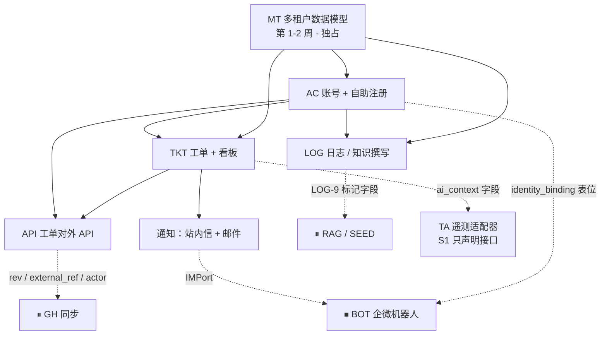

# Relay · S1（核心工作台切片）设计文档

> **依据**：[relay-prd.md](./relay-prd.md) §4（MVP 详细规格）、[relay-mvp-design.md](./relay-mvp-design.md)（MVP 全模块设计）、[TODO.md](../TODO.md)（Phase 1 任务拆解）。
> **本文是 MVP 的一个更小的先行切片，不替代上面三份文档**——被推后的模块规格仍以 [relay-mvp-design.md](./relay-mvp-design.md) 为准，本文只描述**为它们预留的接口位**。

| | |
|---|---|
| **文档状态** | **已确认 · 可开工**。§12 的全部待澄清问题**已按建议决策**（含 RLS 下沉、自助注册租户归属、编号格式、API 契约三字段），决策记录见 [§12.1](#121-决策记录全部采纳建议)。**F-1…F-6 与 R-1…R-3 全部落地** —— F-6 反馈链路的三个细节已定案（**S-22**）。**新增 S-19…S-24 六条决策**：Admin 读 L0 + 读审计 · 定时任务的系统身份 · Guest 只见自己的工单 · 反馈链路细节 · 状态机补两条边 · **Web UI 的 HTTP 层独立成组（WEB-1…4，+4 pd）**。**遗留项为空。** |
| **范围（做）** | **MT** 多租户数据模型 · **AC** 账号（**自助注册为主**）· **LOG** 日志与知识撰写 · **TKT** 工单与看板 + **API** 工单对外 API |
| **范围（只留接口）** | TA 遥测适配器 · BOT 企微机器人 · ⏸ GH GitHub 同步 · ⏸ RAG/SEED 知识问答 |
| **工作量** | **≈ 59 pd ≈ 12 人·周**（§3，含 S-24 补上的 WEB 4 pd）；按 1.7 人·周/日历周约 **7 个日历周** |
| **技术栈** | **已定稿**（D-0）：后端 **Python 3.12+ · FastAPI · SQLAlchemy 2.x + Alembic · Pydantic v2**；前端 **Vue 3 + TS + Vite + Pinia**；**自建 PostgreSQL** 一库承载四件事（RLS 租户强制 · PG FTS 中文检索 · pgvector · `SKIP LOCKED` 队列）；对象存储 **自建 MinIO**（S3 兼容）。端口层全部保留——作用从"回避选型"变成"隔离将来可能替换的部分" → [§2.4](#24-技术栈落地要点d-0-已定稿) |
| **命名** | 沿用 §8.2 锁定名：`@Relay` · `relay.internal` · `RL-`。`relay-sync[bot]` / `relay:meta` 属 ⏸ GH，本切片不出现 |

---

## 1. 范围与两个必须先说清的后果

### 1.1 范围对照

| 模块 | MVP 原状 | S1 决定 | 说明 |
|---|---|---|---|
| **MT** 多租户数据模型 | 8 pd 🔒 | ✅ **全做**（MT-5 除外） | 唯一不可推迟项。pgvector 同库已定 ⇒ MT-5 的实质缩成"建表时打开 RLS policy"，而 S1 内没有向量表可建，故随 RAG 推后（[§4.4](#44-索引与向量库)） |
| **AC** 账号与身份绑定 | 10 pd | ✅ **做账号，改为自助注册为主**；企微/GitHub 绑定推后 | 见 §5，这是本次唯一的**语义变更**而非删减 |
| **LOG** 日志与知识撰写 | 15 pd | ✅ **全做** | 与 MVP 设计一致，见 §6 |
| **TKT** 工单与看板 | 13 pd | ✅ **全做** | 见 §7 |
| **API** 工单对外 API | — | ✅ **新增 ≈ 7 pd** | PRD/TODO 未覆盖，本文首次设计，见 §8 |
| **TA** 遥测适配器 | 5 pd 🔒 | ⚠️ **只留 TA-1 接口声明（1 pd），实现推后** | 见 §10，建议保留而非砍掉，理由在那一节 |
| **BOT** 企微机器人 | 10 pd | ⏹ **推后**（接口位保留） | 连带 AC-6 企微绑定、企微通知一起推后 |
| ⏸ GH / RAG / SEED | Phase 2 | ⏹ 不变 | 挂载点见 §10 |

### 1.2 后果一：S1 内的 AI 价值为零

PRD §4.0 与 §0.3 判断五反复论证过一件事：MVP 必须同时承载**替代价值**（日志 + 工单 + 看板 + 通知）和**AI 价值**，缺后者会退化成"又一个工单系统"，而内部工具的采纳窗口只有第一周。MVP 里 AI 价值全部压在 BOT-3 的"AI 生成工单草稿"上——**它被推后，S1 就一个 AI 触点都没有。**

这不是反对意见，范围是你定的。但两条要写进评审纪要：

1. **S1 的对外说法必须是"工作台先行"，不能宣传成"Relay 上线了"。** 第一次演示如果被理解成 Relay 的完整形态，AI 定位的第一印象就消耗掉了，后面 BOT 上线也换不回来。
2. **BOT 的排期要在 S1 出口时立即定死**，不能变成"以后再说"。S1 交付得越顺，"够用了"的惯性越强——这是这次范围调整最真实的风险，比任何技术风险都大。

### 1.3 后果二：三条 MVP 硬门槛有两条在 S1 内不可判定

| PRD §4.11① 硬门槛 | S1 内 | 处理 |
|---|---|---|
| 跨租户越权读写 = **0** | ✅ 仍是硬门槛 | §4.5 |
| 企微 userid 绑定率 **> 90%** | ❌ 无企微 | 随 BOT 一起判定；S1 不设替代指标 |
| Jira 停用 **100%** | ✅ **已决策：不作为 S1 门槛** | 没有企微通知，"通知触达不到人"是内部工具被弃用的头号原因。Jira 停用等企微通知（随 BOT）到位后再判定（S-9） |
| 草稿确认率 > 60% | ❌ 无机器人 | 随 BOT |

S1 的出口因此是**双轨试用 + 对外 API 打通**，不是 Jira 停用（已决策）。§11 给出 S1 自己的验收标准。

---

## 2. 模块依赖与时序



**三条不可违反的时序**（前两条继承 MVP 设计 §1.1，第三条为本切片新增）：

1. **MT 在第 1–2 周独占完成**，不与功能开发并行。任何一张表漏 `tenant_id`，后面每个模块都在放大返工面。
2. **除适配器外不得有代码直连 Gateway API**，这条即使 TA 只有接口声明也要能被静态检查。
3. **API 的契约（§8）必须在 TKT-1 落表前定稿。** 对外 API 一旦有第一个消费方，字段名、编号规则、状态取值就都改不动了；而 `rev`、`external_ref`、`actor` 三个字段是**建表时加最便宜、事后补最贵**的（理由见 §8.4）。

### 分层

```
┌───────────────────────────────────────────────────────────┐
│ 接入层   Web UI · 对外 REST API (/api/v1) · Webhook 出站    │
├───────────────────────────────────────────────────────────┤
│ 应用层   命令 / 查询编排（UI 与 API 共用，不允许两套实现）   │
│          权限校验（AC-4 服务层）· 幂等 · 乐观并发            │
├───────────────────────────────────────────────────────────┤
│ 领域层   账号 · 日志 · 工单 · 通知                          │
├───────────────────────────────────────────────────────────┤
│ 端口层   RepositoryPort（强制租户过滤）· SearchPort          │
│          BlobPort · MailPort · IMPort(空实现) · LLMPort(未用)│
│          TelemetryAdapter（仅声明）                         │
├───────────────────────────────────────────────────────────┤
│ 基础设施 PostgreSQL（数据 + FTS + pgvector + 队列）· S3 · SMTP │
└───────────────────────────────────────────────────────────┘
```

**横切约束**（全模块生效，不可局部豁免）——继承 MVP 设计 §1.2，其中两条因对外 API 而加强：

| 约束 | 规则 | 强制手段 |
|---|---|---|
| 租户 | 请求进入应用层即确立 `TenantContext`，向下必须携带；Repository 无 context **直接抛错，不做全表查询** | MT-3 + MT-6 负测 |
| 租户（API 加强） | **API 的租户一律从 token 推导，永不从请求体/查询参数读取。** 请求里出现 `tenant_id` 即 400 | 契约测试 + 代码评审清单 |
| 身份 | 所有写操作记录 `actor_id`、`actor_type`(`user`/`integration`/`system`)、`origin`(`web`/`api`/`system`) | 审计表非空约束 |
| 时间 | UTC 存储，展示层按租户时区渲染；TTL 一律 UTC 计算 | — |
| 审计 | 账号、权限、分享级别、工单状态、API token、webhook 配置的变更全部落 `audit_log` | 领域事件统一落库 |
| 幂等（API 加强） | 所有对外写入按 `(tenant_id, principal_id, idempotency_key)` 去重；webhook 出站携带 `event_id` 供消费方去重 | 唯一索引 |
| 错误 | 面向用户的失败必须给出下一步；面向 API 的失败必须给出机器可判别的 `type` | 文案清单 + RFC 9457（§8.6） |

### 2.4 技术栈落地要点（D-0 已定稿）

选型本身见 [relay-mvp-design.md](./relay-mvp-design.md) D-0，不在此重复。**下表只列对 S1 有实施后果的部分**——每一行都是"知道了就少踩一次坑"，不是选型复述。

| 轴 | 定稿 | 对 S1 的实施后果 |
|---|---|---|
| 数据库版本 | **PostgreSQL ≥ 15**（CI 与本机用 16） | 复合外键的 `ON DELETE SET NULL (column)` **列表形式是 PG 15 才有的**（S-18）。用不了它就只能写普通 `SET NULL`，那会连 `tenant_id` 一起置空 —— 而它是 NOT NULL，**删除在运行时炸，不是在评审时炸**。这是目前唯一把版本下限钉死的约束 |
| 租户强制 | **RLS**（Repository 只做便利注入） | 详见下方三条实现细节。`SearchPort` / 向量 / 队列全部在同一个库 ⇒ **它们自动落在同一条 policy 下，没有第二套隔离需要验证** |
| 后端 | FastAPI + Pydantic v2 | `ai_context` 的写入校验直接由 Pydantic 按 `ai_context_field_config` 动态建模，**不是任意 JSON 落库**（§7.3）；对外 API 的错误形状需要改造，见 §8.6 |
| 契约 | FastAPI 自动产出 OpenAPI → 前端 TS codegen | **契约真源的方向反了**：spec 由代码生成，不是 spec 约束代码。纪律随之改变，见 §8.6 |
| 检索 | **PG FTS + pgroonga**（✅ 已确认可安装，F-2；zhparser 兜底作废） | LOG-8 不引入独立检索服务；`SearchPort` 保留的意义是将来真需要外部引擎时替换不波及业务代码 |
| 向量 | pgvector 同库 | MT-5 缩成"建表时打开 policy"，S1 内无表可建（§4.4） |
| 队列 | PG 表 + `FOR UPDATE SKIP LOCKED` | **webhook 出站的重试队列（§8.5）直接用它**，S1 不引入 Redis/MQ。这是 S1 内第一个真实的队列消费方 |
| 对象存储 | **自建 MinIO**（✅ 已决策 F-4） | ⚠️ **唯一逃出 RLS 覆盖的一块**，隔离靠路径含 `tenant_id` + 5 分钟短时签发（S-11，§6.4）。**自建 ⇒ 附件也进备份范围**，见下方责任段 |
| 前端 | Vue 3 + CodeMirror 6 + markdown-it + Mermaid + vuedraggable | LOG-1/2/3 与 TKT-6 的工作量估算按这套组件计，未变 |

**RLS 的三条实现细节**（写不清就白做，其中第二条最容易漏）：

1. **表 owner 默认绕过 RLS** ⇒ 必须 `ALTER TABLE … FORCE ROW LEVEL SECURITY`，且应用以**非 owner 角色**连接。迁移用 owner 角色、运行用受限角色，两个角色要分开。
2. **用事务级 `SET LOCAL app.tenant_id`，不是会话级 `SET`**。SQLAlchemy 侧挂在事务开始事件上，随 `TenantContext` 注入；会话级会因连接池复用**串租户**。**已决策：S1 不引入 PgBouncer**（SQLAlchemy 自带连接池对单团队量级足够）；将来若引入，只能用 **transaction 模式**。
   ⚠️ 另一个同源的坑：`current_setting` 取值**不要带 `missing_ok=true`**。带了则未设置时返回 NULL、policy 判假、**查询静默返回 0 行**，排查方向会全跑偏；不带则直接抛错，正好对上横切约束里"`TenantContext` 缺失即抛异常"。
3. **`SystemRepository` 走独立的、可 `BYPASSRLS` 的连接**，仅迁移与平台运维可用，每次调用落审计。不要用"临时关掉 policy"实现它。

**两条机械门禁**（技术栈定了才写得具体，全部挂 CI）：

- **MT-2 schema lint** = 一个 pytest：反射 `Base.metadata`，断言每张表都有 `tenant_id`，白名单外无豁免（已决策 S-2）。它同时校验 RLS policy 是否已建——**有 `tenant_id` 但没开 policy 的表比没有 `tenant_id` 的表更危险**，因为它看起来是对的。
- **架构守卫** = `import-linter` 契约：接入层不得 import Repository 层（§8.1）；除 TA 适配器包外不得 import Gateway 客户端（§2 时序第 2 条）。

**自建换来的责任（✅ 已由 WANGLI 认领，R-1）**：备份与 PITR、版本升级、连接池、监控告警。其中**备份不是可选项**——已决策 S1 不停用 Jira（S-9），工单还有兜底，**但日志从第一天起就没有任何兜底**。
⚠️ **对象存储定为自建 MinIO（F-4）之后，备份范围是两处而不是一处**：日志正文与工单在 PostgreSQL，**附件与图片在 MinIO**。恢复演练必须**同时覆盖两者**——只恢复 PG 会得到一批正文完好、图片全裂的日志，而这种"半恢复"在演练时不做，就会在真出事时才发现。故 INT-11 = 自动备份（PG + MinIO）+ 一次覆盖两者的真实恢复演练，0.5 pd。

---

## 3. 工作量与周次

| 模块 | 任务 | pd | 角色 |
|---|---|---:|---|
| **MT** | MT-1 实体清单 1 · MT-2 `tenant_id` + schema lint 2 · MT-3 强制过滤 2 · MT-4 索引 0.5 · MT-6 越权负测 1.5 | **7** | BE / QA |
| **AC** | AC-1′ 自助注册 + 邮箱验证 2 · AC-2 认证与安全 1.5 · AC-3 TOTP 1 · AC-4 角色 1.5 · AC-5 空间 1 · AC-8′ 降级矩阵子集 0.5 · **AC-9 新增** 租户归属与首用户引导 1 | **8.5** | BE |
| **LOG** | LOG-1 双模式编辑 3 · LOG-2 渲染 2 · LOG-3 工单卡片内联 1 · LOG-4 版本与回滚 3 · LOG-5 附件 1 · LOG-6 分享 1.5 · LOG-7 模板 1 · LOG-8 搜索 2 · LOG-9 知识库标记 0.5 | **15** | FE / BE |
| **TKT** | TKT-1 实体 1.5 · TKT-2 AI 上下文 schema 2 · TKT-3 状态机 1.5 · TKT-4 评论与@ 1 · TKT-5 列表 1.5 · TKT-6 看板 2.5 · TKT-7 我的工单 0.5 · TKT-8 标签/迭代/PR 链接 1 · TKT-9 详情与永久链接 1.5 | **13** | BE / FE |
| **API** | API-1 token 与鉴权 1.5 · API-2 工单资源端点 1.5 · API-3 幂等 + `rev` + `external_ref` 1 · API-4 webhook 出站 2 · API-5 OpenAPI 与契约测试 1 · **API-6 反馈链路适配 0.5** | **7.5** | BE / QA |
| **WEB** | **新增（S-24，见 [§8.9](#89-web-ui-自己的-http-层s-24--web-14--4-pd)）** WEB-1 错误形状 + 会话依赖 1 · WEB-2 账号与会话路由 1 · WEB-3 日志/附件/搜索 1 · WEB-4 工单/元数据/通知/空间/管理 1 | **4** | BE |
| **通知** | NT-1 站内信 1 · NT-2 聚合窗口 + `MailPort` 声明 0.5 | **1.5** | BE |
| **TA** | TA-1 接口声明 + 架构守卫检查（无实现） | **1** | BE |
| **INT** | INT-1′ CI + 越权门禁 + schema lint 1 · INT-5′ 端到端（注册→日志→工单→API→通知）1 · INT-6′ 双轨试用手册 1 · INT-8′ 最小指标看板 0.5 · **INT-11 备份 + 一次真实恢复演练 0.5** | **4** | QA / BE |
| | **合计** | **61.5** | ≈ 12.3 人·周 |

> 上表 61.5 pd 含 TA-1、通知与 WEB；正文口径的 **≈55 pd** 指四个主模块 + API（7+8.5+15+13+7.5 = 51）加 INT 4。三个数都列出来，避免评审时对不上。
>
> ⚠️ **57.5 → 61.5 是一次真实的范围修正，不是重估**（S-24）：Web UI 的 HTTP 层原先不在
> 任何任务里，而前端 13 pd 全部依赖它。发现的时机是好的——前端还没开工，所以这 4 pd 是
> 补上一个缺口，而不是返工。
>
> **技术栈定稿不改变总量**：省掉手写 OpenAPI（FastAPI 自动产出）约 −0.5 pd，新增前端 TS codegen 接线约 +0.5 pd，净零；新增的 0.5 pd 只有 INT-11 备份演练一项，它是自建 PG 的对价（§2.4）。

**与原 MVP 的差异**：MVP 68.5 pd → S1 61.5 pd，净 −7。

| 方向 | 明细 | 小计 |
|---|---|---:|
| 减 | BOT 10 · TA-2…TA-4 4 · INT 中随 BOT / Jira 停用推后的 4 · AC-6 + AC-7 2.5 · MT-5 1 | **−21.5** |
| 增 | API 7.5 · **WEB 4** · 通知 NT 1.5 · AC-9 租户归属 1 · INT-11 备份恢复演练 0.5 | **+14.5** |

**注意 API 是净新增工作量，不是从 BOT 里挪出来的。**

| 周 | 内容 |
|---|---|
| 1–2 | **MT 独占**（含 schema lint 与 RLS policy 检查上 CI）· 装 pgroonga / pgvector（已确认可装）· TA-1 接口声明 · **API 契约评审定稿**（不写代码，只定 §8 的字段与语义） |
| 3–4 | AC（自助注册 → 登录 → 角色 → 空间）· LOG 起步 · TKT 起步 |
| 5–6 | LOG 收尾 · TKT 收尾 · 通知 · **WEB 1…4（§8.9）** · API-1/2/3 |
| 7 | 前端（LOG-1/2/3 · TKT-5/6/7/9）· API-4 webhook · API-5 OpenAPI 与契约测试 · INT 端到端 · 双轨试用启动 |

> **WEB 排在 API-1/2/3 之前**，因为前端的 13 pd 全部卡在它上面，而对外 API 的第一个消费方
> （网关 WebUI）还没有开始对接。两者共用的错误形状与分页约定在 WEB-1 就立好，所以
> API-1/2/3 继承的是已经成立的约定，不是需要回头统一的两套。

> **AI 角色在 S1 内基本无事可做**（无 BOT、无 RAG、无网关）。这是排期上的真实空档，建议要么让其提前做 RAG 的检索/切片预研，要么并入 API 或前端——不要让它闲置到第 7 周再启动 BOT，那会让 BOT 的排期看起来"突然多出来 10 pd"。

---

## 4. MT · 多租户数据模型

**PRD §4.1 · 7 pd · 🔒 不可推迟 · 第 1–2 周**

> **范围最易读反的一条**：做的是**数据模型层多租户**。租户计费、租户自助管理后台、跨租户共享策略、租户级配置隔离、按租户模型路由都是后续的**产品功能**，S1 不做。读反的代价是数周重构。

### 4.1 实体清单（MT-1 产出物，S1 版）

**全部带 `tenant_id`，无例外。** 下表是 S1 的定义性清单；新增实体必须先进表。相对 MVP 设计 §2.1 的变化标在末列。

| 域 | 实体 | 关键字段（除 `tenant_id` / 审计字段） | 相对 MVP |
|---|---|---|---|
| 租户 | `tenant` | `id`, `name`, `slug`, `status`, `timezone` | — |
| 租户 | `tenant_email_domain` | `domain`, `default_role`, `auto_join` | **新增**（AC-9 自助注册的租户归属，§5.2） |
| 账号 | `user` | `email`, `email_verified_at`, `password_hash`, `status`, `role`, `totp_secret?`, `last_login_at` | +`email_verified_at` |
| 账号 | `email_verification` | `user_id`, `token_hash`, `expires_at`, `consumed_at` | **新增** |
| 账号 | `invitation` | `email`, `role`, `token_hash`, `expires_at`, `accepted_at` | 保留（邀请降为次要路径） |
| 账号 | `identity_binding` | `user_id`, `provider`(`wecom`/`github`), `external_id`, `external_id_kind`, `external_name`, `bound_at` | **建表但 S1 不写入**（BOT 接口位） |
| 账号 | `binding_challenge` | `provider`, `code`, `external_id`, `expires_at`, `consumed_at` | **随 BOT 建表** |
| 空间 | `space` / `space_member` | `name`；`user_id`, `space_role` | — |
| 日志 | `log` | `space_id`, `title`, `body`, `format`, `share_level`, `knowledge_candidate`, `current_version` | — |
| 日志 | `log_version` | `log_id`, `version_no`, `body`, `author_id`, `created_at` | — |
| 日志 | `log_share_grant` / `log_edit_lock` / `log_template` | 见 MVP 设计 §2.1 | — |
| 通用 | `attachment` | `owner_type`, `owner_id`, `blob_key`, `filename`, `size`, `mime` | — |
| 工单 | `ticket` | `number`, `type`, `title`, `description`, `status`, `priority`, `assignee_id`, `reporter_id`, `iteration_id`, `pr_url`, `ai_context`, **`rev`**, **`submitter`** | **+`rev`**（§8.4）· **+`submitter`**（§8.8，机器主体代人提单时记录真实提交者） |
| 工单 | `ticket_external_ref` | `ticket_id`, `system`, `external_id`, `external_url` | **新增**（§8.4） |
| 工单 | `ticket_comment` / `ticket_label` / `label` / `iteration` | — | — |
| 工单 | `ticket_status_history` | `from`, `to`, `actor_id`, `actor_type`, `origin`, `reason?` | +`actor_type`/`origin` |
| 工单 | `ai_context_field_config` | `field_key`, `label`, `type`, `visible`, `domain_scope` | — |
| API | `api_token` | `name`, `principal_type`(`user`/`service`), `principal_user_id?`, `token_hash`, `scopes`, `created_by`, `last_used_at`, `revoked_at` | **新增** |
| API | `api_idempotency_record` | `principal_id`, `idempotency_key`, `request_fingerprint`, `response_snapshot`, `expires_at` | **新增** |
| API | `webhook_endpoint` | `url`, `secret_hash`, `event_types`, `state`, `created_by` | **新增** |
| API | `webhook_delivery` | `endpoint_id`, `event_id`, `event_type`, `payload`, `attempt`, `state`, `next_retry_at`, `last_error` | **新增** |
| 通知 | `notification` / `notification_delivery` | `recipient_id`, `type`, `payload`；`channel`(`inapp`/`email`), `state`, `aggregated_into` | `channel` 去掉 `wecom`（随 BOT 加回） |
| 平台 | `audit_log` | `actor_id`, `actor_type`, `origin`, `action`, `target_type`, `target_id`, `before`, `after` | +`actor_type`/`origin` |
| ⏹ 接口位 | `bot_message_event` / `ticket_draft` / `bot_question_log` | 随 BOT 建表 | 表名先占住，S1 不建 |
| ⏸ 预留 | `knowledge_unit` | Phase 2 建表 | — |
| 平台 | `llm_call_record` | `feature`, `model`, `prompt_tokens`, `completion_tokens`, `cost`, `latency_ms` | **S1 不建**（无 LLM 调用），随 BOT 建 |

> 系统级表（`schema_migration`、`tenant` 自身）不适用 `tenant_id`。**豁免必须是显式白名单 + 书面理由**，写进 MT-2 的 lint 配置，不允许口头豁免（已决策 S-2）。

### 4.2 强制过滤（MT-3）

- 强制点**下沉到数据库层（PostgreSQL RLS）**，Repository / SQLAlchemy 只做便利注入（D-0 定稿，**已确认采纳**）。理由：任何 ORM 都留了裸 SQL 出口，把架构安全押在 ORM 能力上是最该避开的选择。**收益之一是 ORM 选型不再是架构决策**——SQLAlchemy 用错了也漏不出租户。
- `TenantContext` 缺失时**抛异常**，不是"退化为全租户查询"。
- 唯一跨租户路径是显式声明的 `SystemRepository`，仅迁移与平台运维可用，每次调用落审计。
- 实现细节见 [§2.4](#24-技术栈落地要点d-0-已定稿) 的三条（FORCE RLS + 非 owner 角色 · 事务级 `SET LOCAL` · `SystemRepository` 独立连接）。**裸 SQL 的逃逸口因此自动被覆盖**，不必在 lint 里禁用它。

**RLS 覆盖不到的一处：引用完整性（S-18，实施中追认）。**
上面几条把跨租户**读**堵死了，包括裸 SQL。但 **PostgreSQL 做外键检查时绕过 policy**，
所以单列外键留了一个口子：

- 租户 A 能插一行引用租户 B 的行（例如把 B 的用户加进 A 的空间）；
- **读上不漏** —— join 什么也查不到，父行对 A 始终不可见。这正是它危险的地方：
  一套只做读负测的检查会认为这是干净的；
- 但 **B 删那一行时，cascade 会打进 A 的数据**。这是一次跨租户**写**，
  由一个从来没有权限、事后也看不出发生过什么的租户执行。

因此**所有跨表引用一律用复合外键 `(id, tenant_id)`**，父表带 `UNIQUE (id, tenant_id)`。
租户不匹配的那一对在父表里根本没有对应行，数据库直接拒绝写入 ——
和 §4.2 第一条同一个思路：**不押在应用层纪律上**。落点见
`relay.infra.db.base.tenant_fk`；负测见
`tests/test_cross_tenant.py::test_cannot_reference_another_tenants_row`
与 `test_another_tenants_delete_cannot_cascade_into_ours`，
另有一条结构性测试防止新模型悄悄退回单列外键。

> 和 §8.4 那三个字段同构：**建表时加最便宜，事后要迁 32 个外键。**
> 完整决策说明见 [relay-s1-fk-deviation.md](relay-s1-fk-deviation.md)。

### 4.3 API 带来的两个新隔离面

对外 API 把租户隔离的边界从"UI 会话"扩大到"长期有效的凭据"，多了两处 Repository 层管不到的地方：

| 面 | 风险 | 处理 |
|---|---|---|
| `api_token` | token 泄露等于该租户数据长期外泄；token 若能跨租户则 RLS 形同虚设 | token **只属于一个租户**，`principal_id` 解析出的 `TenantContext` 不可被请求覆盖；只存 hash；创建/吊销落审计；展示 `last_used_at` |
| `webhook_endpoint` | 出站 payload 是**主动把租户数据发到租户外的 URL**，RLS 完全不覆盖 | 端点配置为 Admin 操作且落审计；payload 只含该租户数据（消费方隔离靠 endpoint 归属）；签名用每端点独立 secret；**禁止内网 / 回环 / 云元数据地址**（SSRF，已决策 S-13，见 §8.5） |

### 4.4 索引与向量库

- 租户内查询路径建复合索引，**`tenant_id` 前导**：`(tenant_id, status, updated_at)`、`(tenant_id, assignee_id, status)`、`(tenant_id, space_id, updated_at)`、`(tenant_id, number)` 唯一、`(tenant_id, system, external_id)` 唯一（`ticket_external_ref`）、`(tenant_id, principal_id, idempotency_key)` 唯一。
- **MT-5 向量库隔离在 S1 内无对象可隔离**（无 `knowledge_unit` 表）。D-0 已定 **pgvector 与业务表同库**，因此这条不再需要"另设计一套隔离"：向量表就是普通表，**RLS policy 天然生效，「过滤写在查询谓词内部」自动满足**。S1 要做的只有一件事——把这条写进 `SearchPort` 契约，并规定 RAG 建表时**必须与业务表同库同 policy**，不允许为了图快另起一个外部向量服务。

### 4.5 验收

- 一条**故意越权**的 Repository 层查询取不到别租户数据（读写各一组负测，MT-6）。
- **一条持 A 租户 token 访问 B 租户资源的 API 请求返回 404（不是 403）**——不泄露"该资源存在"这一事实。
- CI schema lint 对任何缺 `tenant_id` 的新表**直接失败**（MT-2）。
- 上线前一次渗透抽测，**必须包含 API 与 webhook 两条路径**。

---

## 5. AC · 账号（自助注册为主）

**PRD §4.4 / §4.5 · 8.5 pd · 相对 MVP 有语义变更**

### 5.1 变更说明

MVP 设计里注册路径是「邀请制为主 + 域名白名单为辅」，企微 userid 绑定是 🔒 硬前置。S1 按你的要求改为：

| 项 | MVP | S1 |
|---|---|---|
| 主注册路径 | Admin 邀请 | **用户自助注册** |
| 邀请制 | 主路径 | 保留为次要路径（Admin 邀请特定人，或域名外的例外） |
| 企微 userid 绑定 | 🔒 硬前置 | **推后**（随 BOT）；表位保留，绑定率门槛同步推后 |
| GitHub handle 绑定 | 砍单第 5 位 | **推后**（Phase 2 GH 开工前补齐，约束不变） |

**代价要说清**：自助注册把"谁能进平台"从人工控制变成规则控制。规则一旦写松，平台上会出现无人认领的账号；写紧则第一批用户进不来。§5.2 的租户归属规则就是这条规则本身——**已按"未命中即拒绝 + 域名与租户一对一 + 默认 Member + 邮箱验证必做"定案**（S-3）。

### 5.2 自助注册与租户归属（AC-1′ / AC-9）

**核心问题**：多租户模型下，一次自助注册必须能回答"这个人属于哪个租户"。S1 只有一个租户在跑（PRD §7.1 已定首批团队 = AI 网关团队），但**规则必须现在就写对**，否则第二个租户接入时注册入口要重做。

**规则（✅ 已决策，S-3）**：

```
用户提交注册（邮箱 + 密码）
   ↓ 取邮箱域名，查 tenant_email_domain
   ├─ 命中且 auto_join=true  → 归属该租户，角色取 default_role（= Member）
   ├─ 命中且 auto_join=false → 建待审用户，通知该租户 Admin 审批
   └─ 未命中                → 拒绝注册，提示"请联系管理员获取邀请"（不进待审池）
   ↓
发送邮箱验证邮件（token TTL 24h，一次性）
   ↓ 验证通过 → status=active，可登录
```

- **邮箱验证必做，不可省**：没有验证的自助注册等于允许任意人用同域名的假邮箱进入租户，而 `tenant_email_domain` 是唯一的归属凭据。
- **域名 ↔ 租户一对一**（已决策）：一个域名只能映射一个租户。多对多留到后续，S1 不做——它会让"这个人属于哪个租户"重新变成一个需要人工判断的问题。
- **首个租户与首个 Admin 的引导（bootstrap）**：✅ **已决策做成部署期一次性初始化流程**（首次部署时由部署者创建租户 + 首个 Admin + 域名白名单），**不做**"第一个注册的人自动成为 Admin"——后者在内网环境里是个真实的接管风险。这意味着**部署手册里必须有一步带凭据的初始化**，不是纯自动化。
- 频控：同 IP / 同域名的注册速率限制 + 验证邮件重发冷却，防枚举与刷注册。

### 5.3 认证与安全（AC-2 / AC-3）

- 密码策略：长度 + 复杂度 + **90 天到期提醒**。✅ **已决策：只提醒，不阻断登录**（S-5），避免上线初期摩擦。
- 登录失败锁定（阈值 + 冷却）、会话超时、异地登录提醒（IP 段/UA 变化 → 邮件）。
- **TOTP 可选，建议对 Admin 强制**（配置项，默认开）。自助注册让 Admin 账号成为唯一的管控点，这条比在邀请制下更重要。

### 5.4 角色与权限（AC-4 / AC-5）

三个角色，**判定在服务层**，不做细粒度 RBAC。相对 MVP 设计新增最后两行。

| 能力 | Admin | Member | Guest |
|---|:--:|:--:|:--:|
| 用户管理 / 审批 / 角色变更 | ✅ | ✕ | ✕ |
| 域名白名单配置 | ✅ | ✕ | ✕ |
| AI 上下文字段显隐配置（TKT-2） | ✅ | ✕ | ✕ |
| 日志创建 / 编辑自己的 | ✅ | ✅ | ✕ |
| 工单创建 / 编辑 / 流转 | ✅ | ✅ | ✕ |
| 评论 | ✅ | ✅ | ✕ |
| 查看内容（日志） | **全部级别，含 L0**（见 [§6.3](#63-分享log-6)，S-19） | 按分享级别 | **仅 L1 显式授权 + L3**（已决策 S-6：**不因加入空间而获得 L2**） |
| 查看内容（工单） | 全租户 | 全租户 | **仅自己是负责人或报告人的工单**（S-21，见 [§7.4](#74-视图tkt-5--tkt-6--tkt-7--tkt-9)） |
| **创建 / 吊销 API token** | ✅ | **仅个人 token** | ✕ |
| **配置 webhook 端点** | ✅ | ✕ | ✕ |

**空间**只有一层（`space`），不嵌套；空间成员关系决定 L2 分享范围。

> ✅ **S-19（已决策，业主决策 D-1）**：上表原来给 Admin 写的是"按分享级别"，与 §6.3 的 "L0 = 仅作者 +
> Admin" 冲突。**以 §6.3 为准**（更具体的胜）：**Admin 可读本租户任意日志，包括别人的
> L0 私密草稿。** 这是隐私决策而不是笔误——它等价于"管理员账号 = 全租户阅读权限"，
> 所以它和"谁能当 Admin"是绑在一起的。
>
> 同一决策的另一半是**留痕**：**Admin 靠角色才读到的日志会写一行审计**
> （`log.read_by_admin`，含 `via`）。只记"换成普通 Member 就读不到"的那些读——
> L3、自己的、以及自己被显式授权的 L1 都不记，否则正常浏览会把真正要看的那几行埋掉。
> 没有痕迹的全租户阅读权限，在真出事的时候是查不动的。

### 5.5 降级矩阵（AC-8′）

MVP 的 AC-8 有四行，S1 只剩两行活跃（另两行随 BOT/GH）：

| 场景 | S1 行为 |
|---|---|
| 通知触达 | **只有站内信**（已决策 F-1，§9）——不是降级，是 S1 唯一的触达面 |
| 未验证邮箱的账号登录 | 拒绝并给出"重发验证邮件"入口（必须给下一步） |
| ⏹ 群内 `@Relay` 建单 / 提问 | 随 BOT |
| ⏸ GitHub 同步遇未映射用户 | 随 GH。原则不变：**绝不误 @ 到无关账号** |

> **运维风险，现在就记进手册**：没有 SSO，**离职/转岗不会自动停用账号**，自助注册让这条更重要（账号不是 Admin 一个个发出去的，Admin 未必知道有谁在)。✅ **已由 WANGLI 认领（R-2）**：**每月一次账号复核** + 把"在 Relay 停用账号"加进离职 checklist（PRD §7.2 第 6 条至此关闭）。

---

## 6. LOG · 日志与知识撰写

**PRD §4.6 · 15 pd · 与 MVP 设计 §5 一致，此处只记要点与差异**

### 6.1 编辑与渲染（LOG-1 / LOG-2 / LOG-3）

- **双模式**：Markdown / 纯文本，实时分屏预览。
- 渲染：GFM 全集 + 代码高亮 + **Mermaid** + 工单卡片内联 `#331`（解析为当前租户内工单引用，渲染状态卡片；无权限或不存在时**降级为纯文本，不泄露标题**）。
- **协同**：不做实时协同编辑（CRDT 成本高），改为 `log_edit_lock` **编辑锁 + 冲突提示**。✅ **已决策（S-7）**：TTL **5 分钟** + 心跳续期，超时后他人可接管，接管时提示"上一位编辑者的草稿已另存为版本"——**未保存内容一律存成版本，不丢弃**。

### 6.2 版本与回滚（LOG-4）

- 自动保存产生**版本快照**，保留 **90 天**；diff 按行；**回滚 = 以旧版本内容创建新版本**，历史不删不改写。
- 90 天之后：✅ **已决策做定时清理 + 永久保留最新版本**（S-8），冷存归档留到后续。

### 6.3 分享（LOG-6）

| 级别 | 语义 | 判定 |
|---|---|---|
| L0 | 私密 | 仅作者 + Admin |
| L1 | 指定人 | `log_share_grant` 命中 |
| L2 | 空间内 | 所属 space 的成员 |
| L3 | 全组织 | **本租户内**全体（跨租户永不可见——由 MT 保证，不由 LOG 判断） |

**判定顺序**：租户过滤（MT，前置不可绕）→ 分享级别 → 角色。**Guest 只看得到 L1 显式授权与 L3**，加入空间不授予 L2 可见性（已决策 S-6）。**L4 外链与 DLP 不做**——外链是最大泄露面，S1 不开这个口子。

> ✅ **S-20（已决策）：90 天清理由「系统身份」跑。** 清理需要 `USER_MANAGE`，而调度器
> 没有会话——所以它一度根本跑不起来。定案是给调度器一个自己的身份
> （`ActorType.SYSTEM` + `Origin.SYSTEM` + 一份短能力清单），而不是：
> ① 借某个 Admin 的账号（审计行会记到一个当时在睡觉的人头上，比没有审计更糟）；
> ② 走 `SystemRepository`（那是跨租户 BYPASSRLS 通道，而清理是租户内的普通操作）。
> 唯一走系统通道的是"有哪些租户"这一个跨租户问题，它带书面理由并落审计。
> **系统身份不能服务任何请求**（`origin` 必须是 `SYSTEM`），入口是
> `scripts/purge_log_versions.py`，删除量 > 0 时写一行 `log.versions_purged`。

### 6.4 附件与搜索（LOG-5 / LOG-8）

- 附件走 `BlobPort`：大小/类型限制、病毒扫描位（可空实现）、**访问必须经权限校验后签发短时链接**（✅ 已决策：有效期 **5 分钟**），不靠"URL 猜不到"。**路径含 `tenant_id`**（已决策 S-11）——对象存储是唯一逃出 RLS 覆盖的一块，这条是它唯一的隔离手段。载体为**自建 MinIO**（F-4），因此 **`BlobPort` 的实现要与 INT-11 的备份口径对齐**：附件不在 PG 里，备份与恢复演练都得单独覆盖它。
- 全文搜索走 `SearchPort`，载体定为 **PG FTS + pgroonga**（✅ F-2 已确认可安装），不引入独立检索服务。覆盖日志标题 + 正文 + 工单标题。`SearchPort` 保留的作用是让 pgroonga ↔ zhparser 的切换、以及将来真需要外部引擎时的替换，都不波及业务代码。`SearchPort` 保留的作用是将来真需要外部检索引擎时替换不波及业务代码。

### 6.5 「加入知识库」标记（LOG-9）

**只做字段 + 勾选**：`knowledge_candidate`(bool)、`marked_by`、`marked_at`。向量化与索引随 RAG。

**正样本计数口径**（✅ 已决策 S-16）：**勾选 + 正文长度 ≥ 300 字符**自动计入，验收前**人工抽检 10 篇**确认质量。口径写进 INT-8 看板，不在验收前临时对齐。

> **为什么半做**：S1 起写的每篇日志都已带上"该不该进知识库"的人工判断，RAG 开索引时可**直接回溯全部历史**，省掉一轮全量重标注。约 0.5 pd 换掉一个后续启动阻塞——**BOT/RAG 推得越远，这个字段越值钱，不要因为"反正现在没用"砍掉它。**

### 6.6 不做

L4 外链 + DLP · 实时协同编辑 · `!trace:` / `!metric:` 内联语法（依赖网关集成）· AI 辅助撰写与日报自动生成。

---

## 7. TKT · 工单与看板

**PRD §4.7 / §4.3 · 13 pd**

### 7.1 实体与字段（TKT-1）

类型（Bug / Feature / Task）· 标题 · 描述 · 状态 · 优先级 P0–P3 · 负责人 · 报告人 · 标签 · 迭代 · **关联 PR（纯链接字段，无状态回传、无 CI/Review 状态）** · 评论 · **`rev` 乐观并发版本号**（§8.4 要求，S1 建表时加）。

### 7.2 状态机（TKT-3）

```
Todo ──▶ In Progress ──▶ In Review ──▶ Done
  │           ▲              │           │
  │           └──────────────┘           │   评审打回（S-23）
  │           │              │           │
  └──────▶ Blocked ◀─────────┘           │   （Blocked 可从任一进行中状态进入，恢复回原状态）
  └──────▶ Won't Fix ──▶ Todo ◀──────────┘   重开（Won't Fix 原有；Done 为 S-23 新增）
```

- ✅ **S-23（已决策，业主决策 D-5）：补两条边，都不新增状态**，所以冻结的枚举一个字不动：
  - **`Done → Todo`（重开）**——修完发现没修好。**重开保留原编号与 `rev` 历史**：它是同
    一张工单，`transition()` 只多写一行 `ticket_status_history`。没有这条边，人只能新建
    一个重复工单，而重复工单正是 INT-8 的计数看不穿的东西。
  - **`In Review → In Progress`（评审打回）**——用 `Blocked` 表达是错的：Blocked 是"等
    别的东西"，不是"被打回"。
  - 两条都不要求填理由（只有 Blocked / Won't Fix 要）。**给重开加理由要求看起来像严谨，
    实际会让"新建一个重复单"重新变成更省事的那条路。**
  - 于是 S1 **没有终态**了：Done 与 Won't Fix 都能回到 Todo。这句要明说，因为"这单还会
    回来吗"是看板、指标和 webhook 消费方都要问的问题。
- 完整状态机（Triage / Verifying / Reopened）推迟。
- 每次流转写 `ticket_status_history`（含 `actor_type` / `origin`，区分是人在 UI 上拖的还是外部系统调 API 改的——**这一列在有对外 API 之后才真正有用**）。
- `Blocked` / `Won't Fix` **要求填理由**。
- ⚠️ 这套 6 状态对 GitHub 的 open/closed **是有损的**，将来 `In Review` / `Blocked` / `Won't Fix` 必须落到 label 或 `state_reason`。**状态命名与语义现在就不要再动**，否则 Phase 2 的映射要重来。有了对外 API 之后这条更硬：状态取值一旦出现在 API 响应里，改名就是破坏性变更（§8.6）。

### 7.3 可配置 AI 上下文 schema（TKT-2）

以 **`ai_context` 结构化列 + `ai_context_field_config` 配置表**承载：

| 字段 | 通用性 | S1 状态 |
|---|---|---|
| `trace_id[]` · `provider[]` · `model[]` · `prompt_version` · `deployment` · `error_class` · `eval_run` · `token_cost` · `blast_radius` · `tenant[]` | 通用 AI-Ops | 全租户默认启用；数据模型预留 + UI 可配显隐；**无自动数据源，可手工填写，也可经 API 写入** |
| `gateway_version` · `routing_policy` | Gateway 专属 | 首批租户（AI 网关团队）默认启用，靠 `domain_scope` 控制，不并入通用集 |

- **做它的唯一理由是避免后期加字段的 migration 与索引重建**，不是 S1 可用性。评审按这个理由讲。
- ⚠️ **首批团队就是网关建设方，缺少对照组**：他们提的每个需求都长得像通用需求。判定标准写死一条——**没有自有网关的团队能否给这个字段填出值？填不出就归 `domain_scope`。**
- **S1 新增的一点价值**：API 让外部系统（如网关自己的告警脚本）可以直接把 `trace_id` 写进工单，比等 Phase 2 告警接入早得多。这不改变字段的"预留"定位，但让 §8 的 `ai_context` 写入路径必须**按 `ai_context_field_config` 校验**，而不是任意 JSON 落库。

### 7.4 视图（TKT-5 / TKT-6 / TKT-7 / TKT-9）

- 列表 + 过滤（状态、负责人、优先级、标签、迭代、关键词）；看板按状态分组 + 拖拽；「我的工单」。
- 详情页 + **`RL-` 编号** + 稳定永久链接。
- ✅ **编号与链接已定案（S-12）**：**编号按租户内递增**，永久链接**留出租户段**——规范形式 `https://relay.internal/{tenant_slug}/t/331`，S1 单租户时 UI 可隐藏该段，**路由必须先支持**。
  ⚠️ **发布即冻结**：编号与链接格式会进 API 响应、webhook payload 与外部系统的存量数据，此后改动等同破坏性变更（§8.6）。
- ✅ **S-21（已决策，业主决策 D-3）：Guest 看不到整个看板。** 工单没有分享级别字段，对 Admin 与 Member
  仍是全租户可见（天生 L3）；**Guest 只能读自己是负责人或报告人的工单**。
  - 判定规则是 `relay.app.tickets.sharing.can_read_ticket`，SQL 镜像在
    `relay.infra.db.visibility.visible_tickets_predicate`（列表与搜索共用），两者互相
    校验——一条规则两个实现的漂移，要么是泄露要么是看不见的工单，都不会在 diff 里显形。
  - 拒绝是 **404 而不是 403**：对 Guest 来说，知道 RL-412 存在就已经超出决策允许的范围。
    同理，评论列表、附件、搜索命中都按同一规则过滤，`@提及`一个读不到该工单的 Guest
    **不产生通知**（否则收件箱说"你被提及"、点进去 404，还顺带告诉了对方工单存在）。
  - **没有为此加 per-ticket ACL 列**：角色已经承载了这个区分。真要做按单授权，那是加一列
    + 定一套判定顺序 + 改 §8 响应，属于 v2 级改动。
  - Guest 可以被指派工单（`assignee`），所以这条规则不会让角色失去意义。
- 甘特与日历不做；域特有字段自动填充不做（无数据源）。

### 7.5 评论与通知（TKT-4）

评论 + `@提及`。@提及、指派、状态变更三类事件产出 `notification`，交给统一通知服务（§9）。**经 API 产生的变更同样产出通知**——外部系统改了工单，负责人必须知道，否则 API 会变成一个静默改数据的后门。

---

## 8. API · 工单对外 API（新增设计）

**≈ 7 pd · 契约须在 TKT-1 落表前定稿**

PRD 与 TODO 都没有这一项，这是本文首次设计。目标是让其它平台（CI、告警脚本、网关自己的工具、以及将来的 GH 同步）能读写 Relay 工单。

### 8.1 一条前置原则：API 不是第二套实现

**Web UI 与对外 API 必须走同一套应用层用例。** 对外 API 是那套用例之上的一层**契约**（鉴权、序列化、幂等、错误格式），不是并行实现。否则两条路的状态机校验、权限判定、通知触发必然漂移，而漂移的表现是"UI 改能触发通知，API 改不能"这类没人能一眼看出的 bug。

架构守卫（挂 CI）：接入层的 FastAPI router **不得 import Repository 层**，只能调用应用层用例——用 `import-linter` 契约机械保证（[§2.4](#24-技术栈落地要点d-0-已定稿)），不靠评审记性。

### 8.2 鉴权与租户

| 项 | 设计 |
|---|---|
| 传输 | HTTPS only；`Authorization: Bearer <token>` |
| Token 形态 | 不透明随机串，前缀标识类型（`rly_u_` 个人 / `rly_s_` 服务），**只存 hash**，创建时明文只展示一次 |
| 两种主体 | **个人 token**：以该用户身份操作，权限 = 该用户角色；✅ **Member 可自助创建**。**服务 token**：具名机器主体，权限由 `scopes` 限定，仅 Admin 可创建；✅ **它建的单 `reporter` 显示为机器主体名**（如 `alertmanager`）而非某个人——**"谁提的单"的统计因此必须把机器主体单列一类**，不要混进人头统计 |
| 租户 | **从 token 推导，永不从请求读取。** 请求里出现 `tenant_id` 一律 400 |
| Scopes | `tickets:read` / `tickets:write` / `comments:write` / `meta:read`。✅ **已决策只做这四个**（S-10），粗粒度但够用；不做按字段/按项目的细粒度授权 |
| 生命周期 | 可命名、可吊销、记 `last_used_at`；✅ **默认 365 天过期**（不设过期的 token 是永久后门）；到期前 14 天提醒创建者；创建/吊销落审计 |
| 越权 | 跨租户资源返回 **404**，不返回 403 |

### 8.3 资源与端点（`/api/v1`）

| 方法 | 路径 | 说明 |
|---|---|---|
| `POST` | `/tickets` | 建单。支持 `Idempotency-Key` |
| `GET` | `/tickets` | 列表。过滤（`status`、`assignee`、`priority`、`label`、`iteration`、`updated_since`）+ **游标分页**（`cursor` + `limit`，不用 offset） |
| `GET` | `/tickets/{key}` | 详情。`key` = `RL-331` 或数字编号 |
| `PATCH` | `/tickets/{key}` | 局部更新。**要求 `If-Match: <rev>`** |
| `POST` | `/tickets/{key}/transitions` | 状态流转（与 PATCH 分开，因为流转有校验与理由要求） |
| `GET`/`POST` | `/tickets/{key}/comments` | 评论读写 |
| `GET` | `/tickets/{key}/history` | 状态与字段变更历史 |
| `GET` | `/meta/labels` · `/meta/iterations` · `/meta/users` · `/meta/ticket-fields` | 供外部系统解析枚举与 `ai_context` schema；`/meta/users` 只返回 id/显示名，**不返回邮箱** |
| `GET`/`POST`/`DELETE` | `/webhooks` | Webhook 端点管理（Admin token 专属） |

**预留但 S1 不实现**：`/logs/*`（日志 API）、`/search`。**路由命名空间现在占住**，避免将来和 `/tickets` 的分页/错误约定不一致。

建单请求示例：

```http
POST /api/v1/tickets
Authorization: Bearer rly_s_…
Idempotency-Key: 8f14e45f-ea0a-4f7b-9b1a-2c3d4e5f6a7b
Content-Type: application/json

{
  "type": "bug",
  "title": "provider 侧 429 突增",
  "description": "…",
  "priority": "p1",
  "assignee": "u_1042",
  "labels": ["gateway", "provider-outage"],
  "ai_context": { "trace_id": ["abc123"], "provider": ["openai"] },
  "external_ref": { "system": "alertmanager", "id": "alert-99871",
                    "url": "https://alerts.internal/a/99871" }
}
```

响应 `201`，`Location: /api/v1/tickets/RL-331`，body 含 `key`、`rev`、`url`（`https://relay.internal/{tenant_slug}/t/331`）。

> ⚠️ **`url` 必须带租户段**，与 TKT-9 / S-12 一致。单租户时 UI 可以隐藏这一段，但 API 从第一天就要带全 —— 第一个消费方（网关 WebUI）正是会把这个 url 存进反馈记录的那个，事后补租户段就是它的破坏性变更。

**枚举的线上取值一律 snake_case 小写**：`type` = `bug`/`feature`/`task`，`priority` = `p0`/`p1`/`p2`/`p3`，`status` = `todo`/`in_progress`/`in_review`/`done`/`blocked`/`wont_fix`。一条规则覆盖三个枚举，JSON 里不出现空格与撇号（`Won't Fix` 作为枚举值会污染 URL 参数、日志键和消费方的常量名）；展示名（`In Progress`、`Won't Fix`）只属于前端。**契约评审已定稿，这些取值从此冻结**，改名是 v2 级变更，由 `tests/test_frozen_contract.py` 机械看守。

### 8.4 三个"建表时加最便宜"的字段

这是 §2 时序第 3 条的具体内容。**这三项不是为 S1 加的，是为了让 S1 的 API 不在 Phase 2 变成事故源。**

| 字段 | 作用 | 不现在加的代价 |
|---|---|---|
| **`rev`**（工单单调递增版本号） | 乐观并发：`PATCH` 带 `If-Match: <rev>`，不匹配返回 **409** 并回带当前值。同时进 webhook payload，供消费方丢弃乱序的旧事件 | 无并发控制的写 API 会静默覆盖别人的修改，而这类丢失**没有报错、没有日志、发现时已无法还原** |
| **`actor_type` / `origin`** | 区分"人在 UI 改的"与"某个集成调 API 改的"。Phase 2 GH 同步的**回环三防第一防（Actor 过滤）**直接建立在这一列上 | 事后无法从存量数据里区分来源，回环三防的第一道防线只能靠猜 |
| **`ticket_external_ref`**（`system` + `external_id` 唯一） | "这条外部记录是否已经建过单"从启发式判断变成**数据库事实**。告警脚本重放、CI 重跑、webhook 重投都不会重复建单 | 重复建单是外部集成最常见的失败模式，事后清理很痛；且这正是 GH 同步的内容指纹要落脚的地方 |

`Idempotency-Key`（同一 key 24h 内重放返回首次结果）与 `external_ref`（业务级去重）**两条都要**：前者防网络重试，后者防上游重放。

### 8.5 Webhook 出站（API-4）

| 项 | 设计 |
|---|---|
| 事件 | `ticket.created` · `ticket.updated` · `ticket.status_changed` · `ticket.comment_created` |
| Payload | `event_id`（消费方去重）· `event_type` · `occurred_at` · `tenant` · `actor`（含 `actor_type`）· `ticket`（含 `rev`）· `changes`（变更前后） |
| 签名 | `X-Relay-Signature: sha256=<HMAC(secret, timestamp + "." + body)>` + `X-Relay-Timestamp`，**要求消费方校验时间戳防重放** |
| 投递语义 | **至少一次**，不保证顺序 → 所以 payload 必须带 `rev`，消费方据此丢弃旧值 |
| 重试 | 指数退避（如 1m / 5m / 30m / 2h / 6h），超限进死信，Admin 可重放。**队列用 PG 表 + `FOR UPDATE SKIP LOCKED`**（D-0），不引入 Redis/MQ——这是 S1 内唯一的真实队列消费方，也是 Phase 2 GH 同步死信队列的同一套设施 |
| 安全 | ✅ **已决策：目标地址一律禁止内网 / 回环 / 云元数据地址**（SSRF），且**解析后的 IP 也要校验**（防 DNS rebinding）；不做域名白名单——内部工具，禁私网地址已足够。secret 每端点独立，可轮换 |
| 可观测 | 投递成功率、P95 延迟、死信数——**这是 Phase 2 GH 同步可观测性的预演**，指标口径建议直接沿用 |

### 8.6 契约纪律

- **版本在路径**（`/api/v1`）。v1 内**只允许增量变更**：加字段、加可选参数、加枚举值（消费方必须容忍未知枚举，写进文档）。
- **破坏性变更**（删/改字段、改枚举语义、改编号规则）必须升 v2，且旧版至少并行 90 天。
- **状态取值、`RL-` 编号规则、永久链接格式一旦发布即冻结**（§7.2 / §7.4）。
- ⚠️ **契约真源的方向被技术栈反转了，纪律必须跟着改。** 原计划是"OpenAPI spec 是唯一真源，spec 与实现不一致则 CI 失败"；而 FastAPI 的 spec 是**由代码生成**的，两者永远一致——那条门禁**恒真，等于没有门禁**，而破坏性变更会静悄悄地通过。改成快照门禁（API-5）：
  1. 生成的 `openapi.json` **提交进仓库**；
  2. CI 重新生成并 diff，有差异即失败，**必须由人在 PR 里显式更新快照**——这一步的目的不是拦住变更，而是**让每次契约变更都出现在 diff 里被看见**；
  3. 快照 diff 中若出现删字段 / 改类型 / 改枚举语义，按 §8.6 第 2 条走 v2，不允许在 v1 里合并；
  4. 前端 TS 类型从同一份快照 codegen，**前后端类型对不上会在前端构建期爆掉**，不留到运行时。
- 错误统一 RFC 9457 `application/problem+json`：`type`（稳定 URI，机器判别用）、`title`、`status`、`detail`、`errors[]`（字段级）。
  ⚠️ **FastAPI 的默认错误形状是 `{"detail": …}`，且校验失败默认 422**，与上面这条不一致。必须装一个全局异常处理器，把 `HTTPException` 与 Pydantic 的 `RequestValidationError` **一起**重写成 problem+json（校验错误映射到 `errors[]`）。不做这一步，API 会同时存在两种错误格式，而这是外部集成方最先踩到、也最容易积怨的地方。**建议保留 422 作为校验失败的状态码**（FastAPI 默认，社区习惯），只统一响应体，并在文档里写明。
- 限流：按 token 令牌桶，`429` + `Retry-After` + `X-RateLimit-*`。✅ **已决策初值宽松 + 完整埋点**（S-14）：读 **600 req/min**、写 **120 req/min**（每 token），**观测两周后按真实用量收紧**——上线即收紧会让第一个集成方以为 API 有 bug。

### 8.8 第一个消费方：网关 WebUI 的「问题反馈」入口

✅ **F-3 已定**：首个消费方不是告警脚本，而是 **AI Gateway WebUI 的问题反馈功能**——网关用户提交反馈，在 Relay 里落成工单。

```
网关用户在 AI Gateway WebUI 点「问题反馈」
  → WebUI 后端持服务 token（scopes: tickets:write + tickets:read）
  → POST /api/v1/tickets
       external_ref    = {system:"gateway-webui", id:"<feedback_id>", url:"<回链>"}
       submitter       = {name, email?, external_id?}          ← 真实提交者
       labels          = ["from-gateway-webui"]
       Idempotency-Key = <feedback_id>
  → Relay 落单：reporter = 机器主体，submitter = 真人
  → 详情页显示「由 <submitter.name> 通过 网关 WebUI 提交」
  → 进度回到用户：WebUI 轮询 GET /tickets/{key}（或订阅 webhook）
```

**这个消费方比告警脚本更适合当第一个**：它天然把 API 的三条关键机制全用上了——`external_ref` 去重、主体归属、读路径回显——而且**另一端有真人在等回复**，问题会立刻暴露，不会像脚本那样静默失败半个月。

四条必须现在定清的：

1. **`submitter` 不是 `reporter`。** `reporter` 是服务主体（S-10 已定）；要把真人放进 `reporter`，就得先让网关用户成为 Relay 账号——**他们大多不是，也不该是**。所以新增 `submitter`（结构化列：`name` / `email?` / `external_id?`），**只用于展示与追溯，不参与权限判定，不计入任何人头指标**。
2. **去重靠 `external_ref`，不是 `Idempotency-Key`。** 后者只防网络层重放（24h 窗口）；前者防"用户连点三次提交"和"WebUI 侧补偿重跑"。两个都带，各管一段——这正是 §8.4 把 `external_ref` 列为建表期必加的原因，第一个消费方就用上了。
3. **截图在 S1 不走 API。** 反馈几乎一定带截图，但 S1 的 API 没有附件上传端点，加上去会把 MinIO 的签发与配额暴露给外部消费方，而 `BlobPort` 目前没有配额概念。做法：**截图存在网关侧，URL 贴进工单描述**。这条必须写进对接文档，否则第一天就有人问。
4. **反馈内容不可信。** 它来自人类自由输入，可能含密钥、客户数据或注入尝试，而 S1 没有 DLP。三条最小措施：① WebUI 表单侧提示"不要粘贴密钥或客户数据"；② 正文长度上限；③ 写入的 `ai_context` 一律按 `ai_context_field_config` 校验（§7.3 已定），不接受任意字段落库。

> ⚠️ **一条不属于 API 但决定这条链路成不成立的风险**：**反馈提交了没人回，用户不会再提第二次。** 闭环怎么做属于产品决策 → [F-6](#f-6-反馈链路的三个实现细节)。

### 8.7 验收（API 部分）

- OpenAPI 快照门禁生效：改一个响应字段会让 CI 失败，且必须在 PR 里显式更新快照（§8.6）。
- **所有错误响应都是 problem+json**，包括 Pydantic 校验失败与 404/409/429——用一组负向用例逐个断言。
- 外部系统仅凭 token 完成：建单 → 查列表 → 改字段 → 流转状态 → 评论。
- **同一 `Idempotency-Key` 重放 3 次只产生 1 张工单**；同一 `external_ref` 重复建单被拒并返回既有工单。
- **并发 `PATCH` 一成一败**，失败方得到 409 与当前 `rev`。
- Webhook：签名校验通过；消费方返回 500 时按退避重试并最终进死信；死信可重放。
- 跨租户 token 访问返回 404。

### 8.9 Web UI 自己的 HTTP 层（S-24 · WEB-1…4 · 4 pd）

✅ **S-24（已决策）**：这一层原先**不在计划里**——API-1/2/3 覆盖的是**对外**工单 API
（token 鉴权、`/api/v1`、幂等、webhook），而 Web UI 另外需要会话登录、日志读写、通知已读、
附件上链接这些端点。前端（LOG-1/2/3/7、TKT-5/6/7/9）一行都动不了，因为没有端点可调。
它是范围里少的一块，不是"前端顺手写个后端"。

**两个面，一个应用，不同的契约纪律**：

| | `/web/*` | `/api/v1/*` |
|---|---|---|
| 消费方 | 本仓库里的 Vue 前端 | 外部系统（首个：网关 WebUI） |
| 版本 | **无版本号**：它和消费它的前端一起发布，可以在同一个 commit 里改字段名 | **v1，发布即冻结**（§8.6） |
| 鉴权 | 会话 Cookie（HttpOnly · SameSite=Lax · Secure） | `Authorization: Bearer`（API-1） |
| 快照门禁 | 不入 API-5 的 OpenAPI 快照（前端 TS 类型仍从同一份 schema codegen） | 入快照，改一个字段就要人在 PR 里显式更新 |

**共用的部分必须是同一份实现**，这是 §8.1 的直接推论：

- **错误形状**：RFC 9457 `problem+json` 的全局处理器**从 WEB-1 就装上**（原属 API-5）。
  理由是顺序问题——错误格式最后补，每条路由都要回头改一遍。四个处理器覆盖四种失败：
  应用层拒绝（按 `code` 映射状态码）· Pydantic 校验（**保留 422**，字段进 `errors[]`）·
  Starlette 的 `HTTPException`（**注意是 Starlette 的而不是 FastAPI 的子类**，否则"路由不
  存在"这一个响应会漏成 `{"detail": ...}`）· 兜底 500（**不带 detail**，异常消息是唯一会把
  SQL 片段或路径泄进响应体的地方）。
- **并发**：`If-Match: <rev>` 在 `/web` 上也是**必需**的。少了它就是第二套并发策略，
  竞争的败者会静默覆盖胜者——而这种丢失没有报错、没有日志、发现时已无法还原。
- **分页**：同一个不透明游标（keyset `(updated_at, id)`）。**不透明是契约边界而不是加密**：
  客户端一旦读得懂游标，排序键就成了契约的一部分。
- **租户**：会话解析出 `TenantContext` 后进入请求作用域，向下全部读环境上下文。
  忘记依赖会话的路由不会拿到"未过滤的查询"，而是直接抛 `MissingTenantContext`。

**两条实现约束，写在这里是因为漏了就是整层不工作**：

1. **会话依赖必须是 `async` 的。** FastAPI 把 *同步* 生成器依赖放到工作线程里跑，那里的
   `ContextVar` 是一份拷贝，端点看不到——于是每个请求都 `MissingTenantContext`。异步依赖跑
   在请求自己的 task 里，端点（同步、在线程池里）继承的是它的上下文副本。阻塞调用因此显式
   走 `run_in_threadpool`，而不是把依赖改成同步、把上下文丢掉。
2. **Cookie 的对价是 CSRF。** Session token 放 HttpOnly Cookie 而不是 `localStorage`——两者
   的差别是"一个 XSS 等不等于一次会话被盗"。代价用两层最便宜的防御付：`SameSite=Lax`
   （浏览器不会把 Cookie 带上跨站 POST）+ 状态变更请求的 `Origin` 白名单
   （`RELAY_WEB_ORIGINS`）。**没有 `Origin` 头的请求放行**：那是 curl / 服务端调用 / 测试，
   不是第三方页面能造出来的东西。

**任务与顺序**（4 pd，先立规矩再铺路由）：WEB-1 错误形状 + 会话依赖 + 应用装配 →
WEB-2 账号与会话路由 → WEB-3 日志、附件、搜索 → WEB-4 工单、看板元数据、通知、空间、管理。
做完这一层，`/api/v1`（API-1/2/3）继承的是**已经成立的**错误形状、鉴权接缝与分页约定。

---

## 9. 通知（NT-1 / NT-2 · 1.5 pd）

✅ **已决策（F-1）：S1 只做站内信，不做邮件通知。**

- 事件：工单指派、`@提及`、状态变更（**含经 API 触发的变更**）。
- 渠道：**只有站内信**。`MailPort` 只声明不实现——**发信通道本身是有的（F-5），不发邮件通知是范围选择**，见下方回退口子。
- **5 分钟聚合窗口防轰炸**，逻辑与 MVP 一致，以便 BOT 接入企微时直接复用同一套聚合与 `notification_delivery` 状态机。
- `IMPort` 只声明不实现（空实现 + 单测占位），BOT 到来时新增一个 channel 即可，不改通知领域逻辑。
- 分级路由、免打扰时段、订阅规则不做。

> ⚠️ **只做站内信有一个必须正视的后果**：站内信要求用户**主动进平台**才看得到。S1 的采纳形态因此只能是"团队每天会打开 Relay"，而不是"Relay 会来找人"。两条随之成立：
> ① **Jira 停用仍然不作为 S1 门槛**（S-9）——工单系统没有推送不该成为唯一入口。注意这条的理由**是可消除的**，见下方回退口子；
> ② **工单指派的到达全靠人自己看**，所以列表页的「我的工单」与未读计数在 S1 的重要性上升，它是唯一的触达面。
>
> **这不影响 BOT 到来后的形态**：聚合窗口与 `notification_delivery` 状态机现在就按多渠道建好，企微到来时只是新增一个 channel。
>
> ✅ **一个已经备好的回退口子（F-5 关闭后成立）**：**发信通道是存在的**，S1 不发邮件通知是**范围选择，不是能力限制**。`MailPort` 已声明、聚合窗口与投递状态机已建，所以**补上邮件通知约 0.5 pd**。
> 因此上面那条「没有推送」的后果**不是锁死的**：若第 6 周双轨试用的反馈是"通知看不见"，最便宜的解法是**打开邮件通知，而不是等 BOT**。这条要写进双轨试用的观察项——否则团队会一边忍受触达不足，一边等一个还有 4 周才到的机器人。

---

## 10. 预留接口与挂载点（只留接口，不实现）

| 挂载点 | 位置 | S1 做到哪一步 | 供给 |
|---|---|---|---|
| `TelemetryAdapter` | TA-1 | **接口声明 + 架构守卫检查**（1 pd），无实现、无适配器 | 告警建单 / 变更归因 / ChatOps 只读 / 环境快照四处免返工 |
| `identity_binding` / `binding_challenge` | AC | `identity_binding` **建表不写入**；`binding_challenge` 随 BOT 建 | BOT 的企微绑定、Phase 2 GH 的 handle 映射 |
| `IMPort` + 通知 channel | §9 | 端口声明 + 空实现；`notification_delivery` 已支持多 channel | BOT 接企微时只加 channel，不改领域逻辑 |
| `LLMPort` + `llm_call_record` | — | **只声明端口，不建表**（S1 无 LLM 调用） | BOT-3 草稿生成 + INT-10 预算告警的唯一数据源 |
| 建单流程的"外部创建"入口 | §8.3 `POST /tickets` | 已实现 | **BOT-3 与 GH 都可复用这条用例**，不必各写一遍建单逻辑 |
| `rev` / `actor_type` / `external_ref` | §8.4 | 已实现 | GH 回环三防的三个落脚点 |
| Webhook 出站 | §8.5 | 已实现 | GH 同步的对账与可观测指标口径可直接沿用 |
| `knowledge_candidate` 标记 | LOG-9 | 已实现 | RAG 回溯全部历史日志，免二次标注 |
| `SearchPort` 的租户过滤约束 | §4.4 | **写进契约，未实现** | pgvector 同库已定 ⇒ RAG 建表当周打开 policy 即完成，无第二套隔离 |
| `ai_context` + 显隐配置 | TKT-2 | 已实现（无自动数据源） | Phase 2 告警接入后无需 migration |
| `bot_message_event` / `ticket_draft` / `bot_question_log` | BOT | **表名占位，不建表** | BOT 开工时按 MVP 设计 §7 建 |

> **TA-1 为什么建议保留而不是砍掉**：它的价值不在功能，而在**一条可静态检查的架构约束**——"除适配器外无代码直连 Gateway API"。S1 期间如果没有这条约束，网关团队（同时是 Relay 的运维方）在自己两边都能改代码的情况下，几乎必然会出现一条直连调用；而这条约束一旦被破一次，Phase 2 四个消费方的返工就回来了。1 pd 买一条 CI 检查，建议留。**但要说清它在 S1 内没有任何可演示产出**，否则评审时会被当成"没做出东西"砍掉。

**S1 明确不做**（避免范围蔓延）：企微机器人与群内建单 · 告警接入与 Auto-Ticket · ChatOps · GitHub 双向同步 · RAG 问答与知识索引 · 自有网关路由 · 情绪感知 · 变更归因与环境快照 · SLA 时钟 · On-call 排班 · 变更管理闭环 · AI-DLP · 细粒度 RBAC · L4 外链 · 实时协同编辑 · Trace 下钻 · 完整状态机 · AI 辅助撰写 · MCP Server · AI 评测体系 · 多租户**产品**功能（计费、自助管理、跨租户共享）。

---

## 11. 验收标准（S1 版）

### 11.1 硬门槛

| 类别 | 指标 | 目标 |
|---|---|---|
| **安全** | 跨租户越权读写（含 API 与 webhook 路径） | **0**，CI 门禁常绿 + 上线前一次渗透抽测 |
| **安全** | 缺 `tenant_id` 的新表 | CI **阻断**（schema lint） |
| **API** | 幂等重放产生的重复工单 | **0** |
| **API** | 并发写导致的静默覆盖 | **0**（`rev` 冲突必须 409） |
| **契约** | OpenAPI 快照未随实现更新 | CI **阻断**（§8.6） |
| **数据** | 备份存在但**未做过恢复演练** | 视为无备份，不得开始真实写日志（INT-11 · [R-1](#122-遗留项)） |

### 11.2 功能出口

- 自助注册 → 邮箱验证 → 登录 → 建日志 → 建工单 → **收到站内信**，端到端套件绿（INT-5′）。
- 日志：双模式 · 版本 90 天与回滚 · L0–L3 分享 · 全文搜索 · 知识库标记，全部可用。
- 工单：字段 · 6 状态机 · 列表/看板/我的工单 · 详情与永久链接，可承载真实工作。
- API：§8.7 全部通过；**第一个消费方接通 = AI Gateway WebUI 的「问题反馈」入口**（§8.8）：网关用户提交一条反馈，在 Relay 里落成带 `submitter` 与来源标签的工单，重复提交不产生第二张单。
- **自建 PG 的自动备份就绪，并完成一次真实恢复演练**（INT-11）——日志没有 Jira 兜底，这条排在团队真实写入之前。
- 团队开始**双轨使用**（Relay 与 Jira 并行）。

### 11.3 与 PRD §4.11① 的关系

| PRD 门槛 | S1 |
|---|---|
| 跨租户越权 0 | ✅ 保留，且扩大到 API/webhook |
| 企微绑定率 > 90% | ⏹ 随 BOT |
| Jira 停用 100% | ✅ **已决策：不在 S1 判定**，等企微通知（随 BOT）到位 |
| 草稿确认率 > 60% | ⏹ 随 BOT |
| 周活跃创作者 > 70% | 可在 S1 观测。**分母口径已定**：已激活账号数 / 自然周；**机器主体不计入**（§8.2） |
| 知识库正样本 ≥ 30 篇 | 可在 S1 累积。口径已定：勾选 + 正文 ≥ 300 字符，验收前抽检 10 篇（§6.5） |

---

## 12. 决策记录与遗留项

原「待澄清问题」的全部 S 类问题**已按建议决策**（2026-08-23 确认）。本节从"待答清单"变成**决策记录**——保留每条的结论与落点，便于实施时对照，也便于日后回看"当时为什么这么定"。

### 12.1 决策记录（全部采纳建议）

| # | 决策 | 落在哪一节 |
|---|---|---|
| **S-1a** | **过滤强制点下沉到数据库 RLS**，Repository / SQLAlchemy 只做便利注入。连带：迁移 owner 角色与运行受限角色分开；`SET LOCAL` 事务级；**S1 不引入 PgBouncer**（若将来引入只能 transaction 模式） | [§2.4](#24-技术栈落地要点d-0-已定稿) · §4.2 |
| **S-2** | 系统级表的 `tenant_id` 豁免用**显式白名单 + 书面理由**，进配置文件，新增需 review | §4.1 · §2.4 门禁 |
| **S-3** | 自助注册按邮箱域名归属租户：**未命中即拒绝注册**（不进待审池）· **域名 ↔ 租户一对一** · 命中后默认角色 **Member** · **邮箱验证必做** | §5.2 |
| **S-4** | 首个租户与首个 Admin 由**部署期一次性初始化**创建，**不做**"第一个注册者自动成为 Admin"。部署手册须含一步带凭据的初始化 | §5.2 |
| **S-5** | 密码 90 天到期**只提醒，不阻断登录** | §5.3 |
| **S-6** | Guest **仅见 L1 显式授权 + L3**，加入空间**不**授予 L2 可见性；Guest 不能创建 API token | §5.4 · §6.3 |
| **S-7** | 日志编辑锁 TTL **5 分钟** + 心跳续期；超时可接管，接管时未保存内容**另存为版本，不丢弃** | §6.1 |
| **S-8** | 版本历史 90 天后**定时清理 + 永久保留最新版本**；冷存归档留后续 | §6.2 |
| **S-9** | **Jira 停用不作为 S1 门槛**，等企微通知（随 BOT）到位后判定。S1 出口 = 双轨试用 + 对外 API 打通 | §1.3 · §11 |
| **S-10** | API 只做四个粗粒度 scope；**Member 可自助创建个人 token**，服务 token 仅 Admin 可创建；**服务 token 建的单 `reporter` 显示为机器主体名**，统计时单列一类 | §8.2 · §11.3 |
| **S-11** | 附件路径含 `tenant_id`，访问经权限校验后签发**5 分钟**短时链接 | §6.4 |
| **S-12** | **编号按租户内递增**，永久链接留出租户段 `/{tenant_slug}/t/331`，单租户可隐藏该段但**路由先支持**；**发布即冻结** | §7.4 |
| **S-13** | Webhook 目标地址**一律禁止内网 / 回环 / 云元数据地址**，解析后 IP 也校验（防 DNS rebinding）；不做域名白名单 | §8.5 |
| **S-14** | 限流初值宽松 + 完整埋点：读 **600 req/min**、写 **120 req/min**（每 token），观测两周后收紧 | §8.6 |
| **S-16** | 知识库正样本口径 = **勾选 + 正文 ≥ 300 字符**自动计数，验收前抽检 10 篇 | §6.5 |
| **S-18** | **所有跨表引用用复合外键 `(id, tenant_id)`**，父表带 `UNIQUE (id, tenant_id)`。起因：RLS 不覆盖引用完整性，单列外键下跨租户 cascade 是一次**写**穿透。连带：28 条额外唯一约束 · **PostgreSQL 版本下限 15** · 建模一律走 `tenant_fk()` | §4.2 · §2.4 · [专文](relay-s1-fk-deviation.md) |
| **S-19** | **Admin 可读本租户任意日志（含别人的 L0）**，且**靠角色才读到的日志写一行审计**（`log.read_by_admin`）。L3、自己的、以及自己被显式授权的 L1 不记 | §5.4 · §6.3 |
| **S-20** | **定时任务以「系统身份」运行**（`ActorType.SYSTEM` + `Origin.SYSTEM` + 一份短能力清单），不借用某个 Admin 的账号，也不走 `SystemRepository`；系统身份**不能服务任何请求** | §6.2 · §10 |
| **S-21** | **Guest 只能读自己是负责人或报告人的工单**；Admin / Member 仍全租户可见。**不加 per-ticket ACL 列** | §5.4 · §7.4 |
| **S-22** | 反馈链路三个细节定案：WebUI **展示**进度（轮询，只给状态与最后更新时间）· **由 WebUI 通知提交者** · 反馈默认 **type=Bug / priority=P2**，提交者不能选优先级 | §8.8 · §12.2 |
| **S-23** | 状态机**补两条边**：`Done → Todo`（重开，保留原编号与 `rev` 历史）· `In Review → In Progress`（评审打回）。不新增状态，枚举不动 | §7.2 |
| **S-24** | **Web UI 的 HTTP 层是一组独立任务（WEB-1…4，4 pd）**，不是 API-1/2/3 的一部分；先做错误形状与会话依赖，再做读写路由，最后做对外 `/api/v1` | §8.9 · §3 |
| **§8.4** | `rev`（乐观并发）· `actor_type` + `origin`（来源区分）· `ticket_external_ref`（外部去重）**三个字段建表时就加** | §8.4 · §4.1 |
| **F-1** | **通知只做站内信**，S1 不做邮件通知；`MailPort` 只声明 | §9 · §5.5 |
| **F-3** | **首个 API 消费方 = AI Gateway WebUI 的「问题反馈」入口**（用户提交反馈 → 落成 Relay 工单）；连带需要 `submitter` 字段与固定来源标签 | §8.8 |
| **范围** | S1 范围与 **61.5 pd** 的量级按本文执行（原 57.5 + S-24 的 WEB 4） | §1.1 · §3 |

> **两条决策带来的实施动作，容易在实现时漏掉，单独点出来**：
> ① **S-12 的租户段必须在路由层真实存在**，只是 UI 隐藏——若图快先做成 `/t/331`，第二个租户接入时就是破坏性变更；
> ② **S-10 的机器主体不能混进人头统计**——「周活跃创作者占比」「谁提的单」两处口径都要显式排除服务 token 主体，否则一个告警脚本就能把指标刷上去。

### 12.2 遗留项

原 S-15 / S-17 因性质是"查证"与"认领"而非决策，重编为 **F / R** 两组；S 编号保持不变，便于与早期评审记录对照。

#### 已落地

| # | 结论 | 连带影响 |
|---|---|---|
| **F-1** | **通知只做站内信**，S1 不做邮件通知 | NT 2 → 1.5 pd；`MailPort` 只声明。⚠️ **发信通道存在（F-5），所以这是范围选择而不是能力限制**——邮件通知随时可低成本补上，见 §9 的回退口子 |
| **F-5** | ✅ **事务性发信通道存在** | [AC-1](#52-自助注册与租户归属ac-1--ac-9) 的**邮箱验证原样实现，无改动**；"全部注册走 Admin 审批"的兜底方案作废，自助注册保持完整语义；[AC-8](#55-降级矩阵ac-8) 的"未验证邮箱登录 → 重发验证邮件"一行有效 |
| **F-2** | **pgroonga 可安装** | zhparser 兜底作废，LOG-8 直接按 pgroonga 实施 |
| **F-3** | **首个 API 消费方 = AI Gateway WebUI 的「问题反馈」入口**（用户提交反馈 → 落成 Relay 工单） | 新增 `submitter` 字段与固定来源标签（+0.5 pd，API-6）；截图不走 API；反馈内容按不可信输入处理 → §8.8。剩三个产品细节 → [F-6](#f-6-反馈链路的三个实现细节) |
| **F-4** | **对象存储自建 MinIO** | **备份范围是两处**：PG（正文/工单）+ MinIO（附件），INT-11 的恢复演练必须同时覆盖 |
| **R-1** | **WANGLI 认领 PG + MinIO 的运维与备份** | 频率与保留期见下方建议值；恢复演练时点已定：**团队开始真实写日志之前**，且必须同时恢复两者 |
| **R-2** | **WANGLI 负责无 SSO 期间的离职账号停用** | 需要一条可执行的例行动作，见下方 |
| **R-3** | **BOT 排期在第 7 周（S1 出口评审）给出** | 与建议一致。⚠️ 这意味着 S1 出口评审**必须真的开**，它是唯一把 BOT 从"以后再说"里拉出来的机制（§1.2） |

**R-1 的建议执行值**（除非 WANGLI 另定，按此实施）：

| 对象 | 备份 | 保留 |
|---|---|---|
| PostgreSQL | 每日全量 + WAL 归档（可 PITR） | 全量 30 天，WAL 7 天 |
| MinIO | 每日增量同步到另一位置（不同磁盘/主机） | 30 天 |
| 恢复演练 | **PG + MinIO 一起恢复到一个临时环境**，打开一篇带图片的日志确认正文与附件都在 | 团队真实写日志之前一次；此后每季度一次 |

> **为什么演练一定要带图片的日志**：只恢复 PG 会得到一批**正文完好、图片全裂**的日志。这种"半恢复"不在演练里暴露，就会在真出事时才发现——而那时已经没有第二次机会。

**R-2 的建议执行动作**（同上，除非另定）：**每月一次账号复核**（对照在职名单停用离职账号）+ 把"在 Relay 停用账号"加进离职 checklist。自助注册让这条比邀请制下更要紧——账号不是一个个发出去的，**Admin 未必知道有谁在**。

#### F-6 反馈链路的三个实现细节 —— ✅ 已关闭（S-22）

§8.8 的链路已定，三个产品决策也已定案（原样采纳建议）：

| # | 问题 | 定案 | 实现落点 |
|---|---|---|---|
| ① | WebUI 是否展示处理进度？ | **展示**。轮询 `GET /tickets/{key}`，只显示状态与最后更新时间，**不显示内部评论**——内部讨论不该外泄给提交者 | `TicketView` 现在带 `updated_at`，所以轮询一次就够；"不给评论"是对接文档里的约束，不是 API 的能力边界（服务 token 拿得到 `/comments`，所以这条要写进对接文档） |
| ② | 工单关闭时是否通知提交者？ | **由 WebUI 侧通知**，Relay 只把状态变化告知 WebUI（轮询或 webhook）。**Relay 自己不直接触达网关用户**——那会让 Relay 变成对外系统，属 Phase 4 的范围与安全评审 | API-6 不做任何对外发信；`submitter.email` 只用于展示与追溯 |
| ③ | 反馈的默认 type 与优先级？ | **type=Bug，priority=P2**，由处理人分诊时调整。**不让提交者选优先级**——外部提交的优先级一律不可信，开放选择的结果是一周内全是 P0 | API-6 的默认值，不是 WebUI 的表单默认值：默认值放在被调用的一侧才不会被下一个消费方改掉 |

> ⚠️ 决定这条整合值不值的**不是技术**：**反馈提了没人回，就没人会提第二次。** ①② 就是为了闭上这个环。

#### 仍未落地

无。所有遗留项已关闭。

### 12.3 在 S1 内暂时失效的问题

以下 MVP 设计 §12 的问题因对应模块推后而**暂时不需要答案**，但**必须在对应模块开工前回到桌面**，不能随模块一起被遗忘：

| 问题 | 内容 | 何时必须回来 |
|---|---|---|
| D-4 | 企微 corp → 租户映射 | BOT 开工前 |
| D-6 | 解绑/换绑/离职绑定回收 | BOT 开工前 |
| D-12 | 草稿确认率 > 60% 的判定口径 | BOT 开工前 |
| D-13 | 企微 `from.userid` 的口径与稳定性 | BOT 开工前（它决定 `identity_binding` 怎么写入） |
| ⛔16 | 绑定率 > 90% 由谁推 | BOT 开工前 |
| ⛔5 | AI 月度成本上限 | BOT 开工前（S1 无 LLM 调用，暂无风险） |
| ⛔3 | 是否纳入群内被动监听 | BOT 开工前 |
| ⛔17 | GitHub 状态映射矩阵 | ⏸ GH 开工前 |
| ⛔18 | 入站脱敏最小范围 | ⏸ SEED 开工前 |
| D-5 | 企微能力边界 | ✅ 已关闭（智能机器人 API 模式已开通） |

> ⚠️ **D-13 有一条隐含代价**：MVP 设计把企微 userid 口径的 spike 排在第 1 周，理由是它决定 `identity_binding` 怎么建表，而 MT-1 就在第 1–2 周。S1 里 BOT 推后，这个 spike 也就推后了——**因此 `identity_binding` 在 S1 只能按"建表不写入"处理，BOT 开工时很可能要改一次这张表的结构**。这是本次范围调整**唯一一处真实的返工风险**，代价约 0.5 pd，可以接受，但要知道它存在。

---

## 13. 与既有文档的对应关系

| 本文 | PRD | MVP 设计 | TODO.md |
|---|---|---|---|
| §4 MT | §4.1 | §2 | MT-1…MT-6（MT-5 推后） |
| §5 AC | §4.4 / §4.5 | §4 | AC-1…AC-5、AC-8（AC-6/AC-7 推后）+ **新增 AC-9** |
| §6 LOG | §4.6 | §5 | LOG-1…LOG-9 |
| §7 TKT | §4.7 / §4.3 | §6 | TKT-1…TKT-9 |
| §8 API | **未覆盖** | **未覆盖** | **新增 API-1…API-6** |
| §8.9 WEB | **未覆盖** | **未覆盖** | **新增 WEB-1…WEB-4**（S-24；原先任何文档里都没有这一层） |
| §9 通知 | §4.8④（企微部分推后） | §7.5 | **新增 NT-1 / NT-2** |
| §10 TA 接口位 | §4.2 | §3 | TA-1（TA-2…TA-4 推后） |
| §11 验收 | §4.11① | §8.1 | Milestone A exit criteria 的子集 |

**建议同步更新 TODO.md**：新增 API / WEB / NT / AC-9 四组任务，并把 BOT、TA-2…TA-4、AC-6、AC-7、MT-5 标为 S1 之后。本文未直接改 TODO.md——**等这份设计确认后再一次性改，避免任务清单在评审中途反复变动。**

**本切片的其它文档**：

| 文档 | 用途 |
|---|---|
| [TODO-S1.md](../TODO-S1.md) | S1 的执行视图：任务、状态、每个任务落地后的实现说明 |
| [relay-s1-dev.md](relay-s1-dev.md) | 开发上手：怎么跑起来、怎么写一个不绕过租户与权限的改动 |
| [relay-s1-deploy.md](relay-s1-deploy.md) | 部署须知：密钥与凭据、superuser 步骤、租户初始化、上线前清单（O-1…O-5） |
| [relay-s1-owner-actions.md](relay-s1-owner-actions.md) | 需要人来决定或执行的事项，以及每一条的结论与落点 |
| [relay-s1-entities.md](relay-s1-entities.md) | MT-1 实体清单快照（由 `scripts/gen_entity_registry.py` 生成） |
| [relay-s1-fk-deviation.md](relay-s1-fk-deviation.md) | S-18 复合外键的完整论证，含落选的替代方案 |
